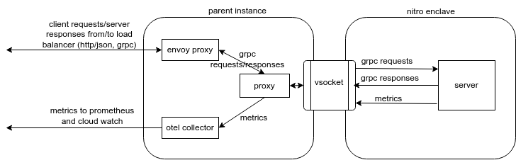

# AWS AMI Structure

## What is packaged in the AWS ami?

Let:

-   `$DIST = $WORKSPACE/dist`
-   `$AWS_PACKAGING = $WORKSPACE/production/packaging/aws`

| artifact                    | artifact description          | artifact location                       |
| --------------------------- | ----------------------------- | --------------------------------------- |
| server_enclave_image.eif    | Contains the binary used to   | - After building locally:               |
|                             | launch the KV server inside   | `$DIST/aws/server_enclave_image.eif`    |
|                             | the enclave.                  | - In releases, it's under **Assets**    |
| proxy                       | Abstracts the vsocket and     | - After building locally:               |
|                             | manages communication between | `$AWS_DIST/proxy`                       |
|                             | the server inside the enclave | - In releases, it's under **Assets**    |
|                             | and it's clients and          |                                         |
|                             | dependencies outside the      |                                         |
|                             | enclave. Runs as a service    |                                         |
|                             | deamon on parent instance.    |                                         |
| vsockproxy.service          | `systemd` definition for      | - In releases, it's under **Assets**    |
|                             | the `proxy` service.          |                                         |
| envoy docker image          | Acts as a sidecar proxy       | - Pulled from dockerhub:                |
|                             | infront of the server and     | `envoyproxy/envoy-distroless:v1.24.1`   |
|                             | also transcodes HTTP/JSON     |                                         |
|                             | to grpc.                      |                                         |
| envoy.yaml                  | Configuration for the         | - In releases, it's under **Assets**    |
|                             | envoy proxy.                  |                                         |
| query_api_descriptor_set.pb | Compiled server API           | - After building locally:               |
|                             | descriptor used by envoy      | `$DIST/aws/query_api_descriptor_set.pb` |
|                             | proxy for transcoding         |                                         |
|                             | HTTP/JSON.                    |                                         |
| aws-otel-collector.rpm      | OTEL collector binaries       | - After building locally:               |
|                             | for pushing metrics to        | `$DIST/aws/aws-otel-collector.rpm`      |
|                             | AWS metric services           |                                         |
|                             | such as CloudWatch. Runs      |                                         |
|                             | as deamon on parent           |                                         |
|                             | instance.                     |                                         |
| otel_collector_config.yaml  | Configuration for the         | - After building locally:               |
|                             | OTEL collector.               | `$DIST/aws/otel_collector_config.yaml`  |

## How are the binaries and files deployed on an EC2 instance?

## How is the server launched on EC2 instance launch?

The
[instance launch script](https://github.com/privacysandbox/fledge-key-value-service/blob/main/production/terraform/aws/services/autoscaling/instance_init_script.tftpl)
is used to startup the KV server and other relevant components when the EC2 instance is launched.
