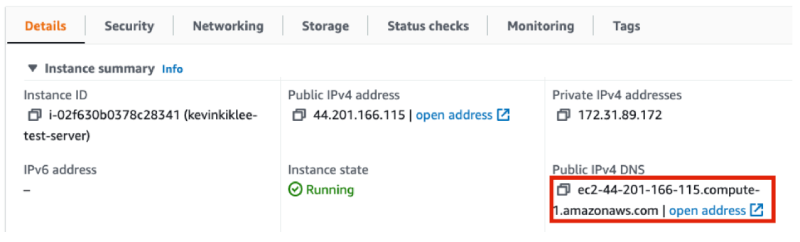

# FLEDGE Key/Value server deployment on AWS

This article is for adtech engineers who will set up the cloud infrastructure and run the Key/Value
server for [FLEDGE](https://developer.chrome.com/docs/privacy-sandbox/fledge/) usage.

To learn more about FLEDGE and the Key/Value server, take a look at the following documents:

- [FLEDGE Key/Value server explainer](https://github.com/WICG/turtledove/blob/main/FLEDGE_Key_Value_Server_API.md)
- [FLEDGE Key/Value server trust model](https://github.com/privacysandbox/fledge-docs/blob/main/key_value_service_trust_model.md)
- [FLEDGE explainer](https://developer.chrome.com/en/docs/privacy-sandbox/fledge/)
- [FLEDGE API developer guide](https://developer.chrome.com/blog/fledge-api/)

    > The instructions written in this document are for running a test Key/Value server that does
    > not yet have full privacy protection. The goal is for interested users to gain familiarity
    > with the functionality and high level user experience. As more privacy protection mechanisms
    > are added to the system, this document will be updated accordingly.

For the initial testing of the Key/Value server, you must have or
[create an Amazon Web Services (AWS)](https://portal.aws.amazon.com/billing/signup/iam) account.
You’ll need API access, as well as your key ID and secret key.

# Set up your AWS account

## Setup AWS CLI

[Install the AWS CLI](https://docs.aws.amazon.com/cli/latest/userguide/getting-started-install.html),
then set the
[AWS CLI environment variables](https://docs.aws.amazon.com/cli/latest/userguide/cli-configure-envvars.html).
The access key and secret environment variables are required to be exported for the server
deployment process to work.

```sh
export AWS_ACCESS_KEY_ID=[[YOUR_ACCESS_KEY]]
export AWS_SECRET_ACCESS_KEY=[[YOUR_SECRET_KEY]]
export AWS_DEFAULT_REGION=[[YOUR_REGION]]
```

You can also add the environment variables to your shell startup script (such as `.bashrc`) to set
them on load.

## Setup EC2 SSH key pair

The Key/Value server uses [Terraform](https://www.terraform.io/) to perform deployment operations.
In the Terraform config, you can specify which SSH key pair you want to associate with the EC2
instance. The key pair can be generated from either the UI or with the AWS CLI tool. Once the key
pair has been generated, store the private key in a location that you prefer.

In this walkthrough, the private key will be stored under `~/key.pem.`This key will be used to SSH
into our EC2 instance later.

> Warning: For both approaches below, do not lose your private key as it cannot be retrieved again.
> If you lose the private key, restart this step and generate a new key pair.

### Generating the key pair from the UI

To generate the key pair from the UI, visit the EC2 console, and open the **Key Pairs** page under
the “Network & Security'' section in the sidebar. Click **Create pair**, then set “Key pair type” to
`RSA` and “Private key file format” to `.pem`.

Once the private key has been provided, store it into a location of your choice.

### Generating the key pair with AWS CLI

Run the following command in the terminal (replace `[YOUR_KEY_NAME]` with the desired key pair
name):

```sh
aws ec2 create-key-pair --key-name [YOUR_KEY_NAME] --key-type rsa --key-format pem --query "KeyMaterial" --output text > ~/private-key.pem
```

Store the private key into a location of your choice.

## Setup S3 bucket for Terraform states

Terraform state data can be stored into S3, and the bucket must be manually created first. Create a
bucket from the AWS UI Console or CLI and note the bucket name.

> Gotcha: The bucket name must be globally unique

Then make sure that the bucket is accessible by the account running Terraform by adding the
following to the bucket policy. The account ID can be found
[using the console, AWS CLI, or the API](https://docs.aws.amazon.com/IAM/latest/UserGuide/console_account-alias.html#FindingYourAWSId):

```json
{
    "Version": "2012-10-17",
    "Statement": [
        {
            "Effect": "Allow",
            "Principal": {
                "AWS": "arn:aws:iam::[[ACCOUNT_ID]]:root"
            },
            "Action": "s3:ListBucket",
            "Resource": "arn:aws:s3:::[[BUCKET_NAME]]"
        },
        {
            "Effect": "Allow",
            "Principal": {
                "AWS": "arn:aws:iam::[[ACCOUNT_ID]]:root"
            },
            "Action": ["s3:GetObject", "s3:PutObject", "s3:DeleteObject"],
            "Resource": "arn:aws:s3:::[[BUCKET_NAME]]/*"
        }
    ]
}
```

In the AWS console, visit the Permissions tab of the S3 bucket. Click the “Edit” button for “Bucket
policy”, and copy-paste the above policy with your information filled out.

# Build the Key/Value server artifacts

Before starting the build process, install [Docker](https://docs.docker.com/engine/install/) and
[Bazelisk](https://github.com/bazelbuild/bazelisk/blob/master/README.md#installation). If you run
into any Docker access errors, follow the instructions for
[setting up sudoless Docker](https://docs.docker.com/engine/install/linux-postinstall/#manage-docker-as-a-non-root-user).

## Get the source code from GitHub

The code for the FLEDGE Key/Value server is released on
[GitHub](https://github.com/privacysandbox/fledge-key-value-service).

Using Git, clone the repository into a folder:

```sh
git clone https://github.com/privacysandbox/fledge-key-value-service.git
```

## Build the Amazon Machine Image (AMI)

From the Key/Value server repo folder, execute the following command:

```sh
./production/packaging/build_and_test_all_in_docker --with-ami
```

The script will build the Enclave Image File (EIF), store it in an AMI, and upload the AMI. If the
build is successful, you will see an output similar to:

```text
==> Builds finished. The artifacts of successful builds are:
--> amazon-ebs.dataserver: AMIs were created:
us-east-1: ami-0fc7e6b563291d9c6
```

Take a note of the AMI ID from the output as it will be used for Terraform later.

# Deployment

## Push artifacts

Set and export the `AWS_ECR` environment variable to your AWS Elastic Container Registry address such as

```sh
export AWS_ECR=123456789.dkr.ecr.us-east-1.amazonaws.com
```

Then run `dist/push_sqs` to push the SQS cleanup lambda image to AWS ECR.

## Set up Terraform

The setup scripts require Terraform version 1.0.4. You can
[download Terraform version 1.0.4 directly](https://releases.hashicorp.com/terraform/1.0.4/), or you
can use [Terraform Version Manager (tfenv)](https://github.com/tfutils/tfenv) instead. If you have
`tfenv` installed, run the following in your `&lt;repository_root>` to set Terraform to version
1.0.4:

```sh
tfenv install 1.0.4;
tfenv use 1.0.4
```

## Update Terraform configuration

For your Terraform configuration, you can use the template under
`production/terraform/aws/environments/demo`. Copy the entire folder to another folder named with
your environment name such as dev/staging/prod, name the files inside according to the region you
want to deploy to, and update the following file content.

In `[[REGION]].tfvars`:

- Environment
  - `service` - Name of the Key/Value server.
  - `environment` - The default is `demo`. The value can be any arbitrary unique string, and for
        example, strings like `staging` and `prod` can be used to represent the environment that the
        Key/Value server will run in.
  - `region` - Update the region that the Key/Value server will operate in. The default is
        `us-east-1`.
- Network
  - `root_domain` - Set the root domain for the server.
    - If your domain is managed by [AWS Route 53](https://aws.amazon.com/route53/), then you
            can simply set your domain value to the `root_domain` property in the Terraform
            configuration that will be described in the next section. If your domain is not managed
            by Route 53, and you do not wish to migrate your domain to Route 53, you can
            [delegate subdomain management to Route 53](https://docs.aws.amazon.com/Route53/latest/DeveloperGuide/CreatingNewSubdomain.html).
  - `root_domain_zone_id` - Set the hosted zone ID. The ID can be found in the details of the
        hosted zone in Route 53.
  - `certificate_arn`
    - If you want to create a public AWS ACM certificate for a domain from scratch, follow
            [these steps to request a public certificate](https://docs.aws.amazon.com/acm/latest/userguide/gs-acm-request-public.html).
    - If you want to import an existing public certificate into ACM, follow these steps to
            [import the certificate](https://docs.aws.amazon.com/acm/latest/userguide/import-certificate.html).
- EC2 instance
- `instance_type` - Set the instance type. Use instances with at least four vCPUs. Learn more
    about which types are supported from the
    [AWS article](https://docs.aws.amazon.com/enclaves/latest/user/nitro-enclave.html).
- `instance_ssh_key_name` - Set the value to the SSH key pair name that was generated earlier.
- `instance_ami_id` - Set the value to the AMI ID that was generated when the image was built.
- Server configuration
- `mode` - Set the server mode. The acceptable values are “DSP” or “SSP”.
- `server_port` - Set the port of the EC2 parent instance (that hosts the Nitro Enclave instance).
- `enclave_cpu_count` - Set how many CPUs the server will use.
- `enclave_memory_mib` - Set how much RAM the server will use.
- Data storage
- `sqs_cleanup_image_uri`
- `s3_delta_file_bucket_name` - Set a name for the bucket that the server will read data from. The
    bucket name must be globally unique. This bucket is different from the one that was manually
    created for Terraform states earlier.

In `[[REGION]].backend.conf`:

- `bucket` - Set the bucket name that Terraform will use. The bucket was created in the previous
    [Setup S3 bucket for Terraform states](#setup-s3-bucket-for-terraform-states) step.
- `key` - Set the filename that Terraform will use.
- `region` - Set the region where Terraform will run. This should be the same as the region in the
    variables defined.

## Apply Terraform

From your `repository/production/terraform/aws/environments` folder, run:

```sh
ENVIRONMENT=[[YOUR_ENVIRONMENT_NAME]]
REGION=[[YOUR_AWS_REGION]]
```

Initialize the working directory containing Terraform configuration files:

```sh
terraform init --backend-config=./${ENVIRONMENT}/${REGION}.backend.conf --var-file=./${ENVIRONMENT}/${REGION}.tfvars --reconfigure
```

Generate/update AWS resources:

```sh
terraform apply --var-file=./${ENVIRONMENT}/${REGION}.tfvars
```

Once the operation completes, you can find the server URL in the `kv_server_url` value of the
output.

## Confirm resource generation

Once you have executed Terraform, the server URL will be available at the end of the console log (as the terraform output). To confirm, query
“<https://demo.kv-server.your-domain.example/v1/getvalues?kv_internal=hi>” either through your
browser or curl and you should be able to see a "Hello World" quote returned. See
[query the server](#query-the-server) section for more information.

> Note: When the instance is created for the first time, the server may not be able to properly start up due to cloud dependency initialization. Wait for ten minutes or so and you should be able to query.

At least the following AWS resources should have been generated:

- EC2
  - Visit the EC2 console and confirm that new instances have been generated.
  - There should be at least 2 instances, depending on the autoscaling capacity you have
        specified.
    - There is an SSH instance that you will use to SSH into the Key/Value server instances.
    - There are at least one or more Key/Value server instances that run the actual server
            code.
  - Confirm that “Instance state” is showing “Running”, and “Status check” shows “2/2 checks
        passed”.
- S3
  - Visit the S3 console and confirm that a new bucket has been created.
  - In the bucket detail page, check the “Event notification” section under the “Properties”
        tab. The bucket should be associated with an SNS topic.
- SNS/SQS
  - Visit the SNS console and confirm that the topic we saw associated with the bucket exists,
        and that it has an SQS subscribed to it.

## Setting up routing

For the DSP Key/Value server, the server’s origin must match the interest group owner’s origin. For
the SSP Key/Value server, the server’s origin must match the seller’s origin in the auction config.

For example, the interest group owner’s origin may be `https://dsp.example` where
`https://dsp.example/scripts/bid.js` serves the bidding script and
`https://dsp.example/bidding-signals` serves the response from the DSP Key/Value server. For SSP,
the seller’s origin may be `https://ssp.example` where `https://ssp.example/scripts/ad-scoring.js`
serves the ad scoring script, and `https://ssp.example/scoring-signals` serves the response from the
SSP Key/Value server.

Since each infrastructure architecture is different (for example, your web serving setup may be
using a static S3 bucket, a lambda, or an EC2 server), the actual implementation steps are out of
scope for this documentation.

# Loading data into the server

Refer to the [FLEDGE Key/Value data loading guide documentation](./loading_data.md) for loading data
to be queried into the server.

# Common operations

## Query the server

When you run `terraform apply`, the output will include the server URL as the `kv_server_url` value.
You can also get the server URL by visiting “Route 53 / Hosted zones / Records”. The hosted zone
will be named as the value of `module/root_domain` in the Terraform config. The URL of your
environment will be in the format of: `https://[[ENVIRONMENT]].[[ROOT_DOMAIN]]`, and the GET path is
`/v1/getvalues`.

Once you have constructed your URL, you can use [curl](https://curl.se/) to query the server:

```sh
KV_SERVER_URL="https://demo.kv-server.your-domain.example/v1/getvalues"
curl ${KV_SERVER_URL}/v1/getvalues?keys=foo1
```

## SSH into EC2


### Step 1: SSH into the SSH EC2 instance

The SSH instance is a dedicated EC2 instance for operators to SSH from the public internet. We will
need the key generated [earlier](#setup-ec2-ssh-key-pair), and the Public IPv4 address of the
instance. The public address can be retrieved from the EC2 dashboard.



Confirm that you can SSH into your SSH EC2 instance by executing the following command in the
terminal with your information filled in:

```sh
EC2_PRIVATE_KEY='[[YOUR_PRIVATE_KEY_LOCATION]]'  # Example: '~/key.pem'
SSH_EC2_ADDRESS='[[YOUR_SSH_EC2_ADDRESS]]'  # Example: 'ec2-44-201-166-115'

ssh -i ${EC2_PRIVATE_KEY} ec2-user@${SSH_EC2_ADDRESS}.compute-1.amazonaws.com
```

If you are having trouble connecting to your EC2 instance, look through the
[AWS SSH connection article](https://docs.aws.amazon.com/AWSEC2/latest/UserGuide/AccessingInstancesLinux.html).

### Step 2: SSH into the actual EC2 instance from the SSH instance

Once you have confirmed that you can connect to the SSH instance, copy the private key from the
local environment to the SSH instance, so that it can be used to connect to the Key/Value server
instances. From your local environment:

```sh
scp -i ${EC2_PRIVATE_KEY} ~/key.pem ec2-user@${SSH_EC2_ADDRESS}.compute-1.amazonaws.com:/home/ec2-user/

```

Then login to the server instance from the SSH instance. This time, the address of the destination
server can be found under “private IPV4 addresses” in the EC2 dashboard.

```sh
SERVER_EC2_ADDRESS='[[YOUR_SERVER_EC2_ADDRESS]]'
ssh -i ${EC2_PRIVATE_KEY} ec2-user@${SERVER_EC2_ADDRESS}.compute-1.amazonaws.com
```

Once you have connected to the instance, run `ls` to see the content of the server. The output
should look similar to something like this:

```sh
[ec2-user@ip-11-11-11-11 ~]$ ls
proxy server_enclave_image.eif
```

## Check the Key/Value server

The server EC2 instance is set up to automatically start the Key/Value server on setup, and when you
SSH into your server instance the first time, the server should be already running. Verify the
server is running by executing:

```sh
nitro-cli describe-enclaves
```

You should see an output similar to the following:

```json
[
    {
        "EnclaveName": "server_enclave_image",
        "EnclaveID": "i-02f630b0378c28341-enc18212a6cae2dae4",
        "ProcessID": 5379,
        "EnclaveCID": 16,
        "NumberOfCPUs": 2,
        "CPUIDs": [1, 3],
        "MemoryMiB": 4096,
        "State": "RUNNING",
        "Flags": "DEBUG_MODE"
        // …and more
    }
]
```

## Read the server log

Most recent server logs can be read by executing the following command:

```sh
ENCLAVE_ID=$(nitro-cli describe-enclaves | jq -r ".[0].EnclaveID"); [ "$ENCLAVE_ID" != "null" ] && nitro-cli console --enclave-id ${ENCLAVE_ID}
```

## Start the server

If you have shutdown your server for any reason, you can start the Key/Value server by executing the
following command:

```sh
nitro-cli run-enclave --cpu-count 2 --memory 3072 --eif-path /home/ec2-user/server_enclave_image.eif --debug-mode --enclave-cid 16
```

## Terminate the server

Terminate the Key/Value server by executing the following command:

```sh
ENCLAVE_ID=$(nitro-cli describe-enclaves | jq -r ".[0].EnclaveID"); [ "$ENCLAVE_ID" != "null" ] && nitro-cli terminate-enclave --enclave-id ${ENCLAVE_ID}
```

## Updating the server

When a new server code is released, pull down the latest code and re-execute the steps from the
previous [Build the Amazon Machine Image](#build-the-amazon-machine-image-ami) section. Execute the
following command:

```sh
./production/packaging/build_and_test_all_in_docker --with-ami
```

Then set the new AMI ID in the Terraform config. Re-apply Terraform to deploy the updated server.

For development on non-production instances, a faster approach is available in the [developer guide](/docs/developing_the_server.md).

# Frequently asked questions

## How to rename resources via Terraform

If you wish to rename resources that have already been generated in a dev environment, then you can
run `terraform destroy` to take down the resources, and you can run `terraform apply` again.

If your server is already running in production, and you cannot destroy the resources, refer to the
[`state mv` command](https://www.terraform.io/cli/commands/state/mv) documentation.

## How to update resource allocation

You may run into a case where the server fails to start due to resource allocation errors, such as
“`Insufficient CPUs available in the pool. User provided`cpu-count`is 2, which is more than the configured CPU pool size.`”

The resources are allocated by specifying the per-TEE values in the terraform variable file, `enclave_cpu_count` and `enclave_memory_mib`.
