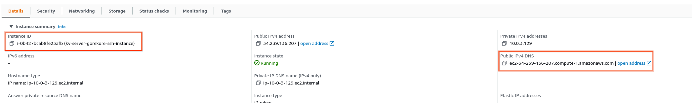

> FLEDGE has been renamed to Protected Audience API. To learn more about the name change, see the
> [blog post](https://privacysandbox.com/intl/en_us/news/protected-audience-api-our-new-name-for-fledge)

# FLEDGE Key/Value server deployment on AWS

This article is for adtech engineers who will set up the cloud infrastructure and run the Key/Value
server for [FLEDGE](https://developer.chrome.com/docs/privacy-sandbox/fledge/) usage.

To learn more about FLEDGE and the Key/Value server, take a look at the following documents:

-   [FLEDGE Key/Value server explainer](https://github.com/WICG/turtledove/blob/main/FLEDGE_Key_Value_Server_API.md)
-   [FLEDGE Key/Value server trust model](https://github.com/privacysandbox/fledge-docs/blob/main/key_value_service_trust_model.md)
-   [FLEDGE explainer](https://developer.chrome.com/en/docs/privacy-sandbox/protected-audience/)
-   [FLEDGE API developer guide](https://developer.chrome.com/blog/fledge-api/)

    > The instructions written in this document are for running a test Key/Value server that does
    > not yet have full privacy protection. The goal is for interested users to gain familiarity
    > with the functionality and high level user experience. As more privacy protection mechanisms
    > are added to the system, this document will be updated accordingly.

For the initial testing of the Key/Value server, you must have or
[create an Amazon Web Services (AWS)](https://portal.aws.amazon.com/billing/signup/iam) account.
You'll need API access, as well as your key ID and secret key.

# Set up your AWS account

## Setup AWS CLI

Install the [AWS CLI](https://docs.aws.amazon.com/cli/latest/userguide/cli-chap-welcome.html). Set
up
[AWS CLI environment variables](https://docs.aws.amazon.com/cli/latest/userguide/cli-configure-envvars.html).
The access key and secret environment variables are required to be exported for the server
deployment process to work.

```sh
export AWS_ACCESS_KEY_ID=[[YOUR_ACCESS_KEY]]
export AWS_SECRET_ACCESS_KEY=[[YOUR_SECRET_KEY]]
export AWS_DEFAULT_REGION=[[YOUR_REGION]]
```

You can also add the environment variables to your shell startup script (such as `.bashrc`) to set
them on load.

## Setup S3 bucket for Terraform states

Terraform state data can be stored into S3, and the bucket must be manually created first. Create a
bucket from the AWS UI Console or CLI and note the bucket name.

> Gotcha: The bucket name must be globally unique

Then make sure that the bucket is accessible by the account running Terraform by adding the
following to the bucket policy. The account ID can be found
[using the console, AWS CLI, or the API](https://docs.aws.amazon.com/IAM/latest/UserGuide/console_account-alias.html#FindingYourAWSId):

```json
{
    "Version": "2012-10-17",
    "Statement": [
        {
            "Effect": "Allow",
            "Principal": {
                "AWS": "arn:aws:iam::[[ACCOUNT_ID]]:root"
            },
            "Action": "s3:ListBucket",
            "Resource": "arn:aws:s3:::[[BUCKET_NAME]]"
        },
        {
            "Effect": "Allow",
            "Principal": {
                "AWS": "arn:aws:iam::[[ACCOUNT_ID]]:root"
            },
            "Action": ["s3:GetObject", "s3:PutObject", "s3:DeleteObject"],
            "Resource": "arn:aws:s3:::[[BUCKET_NAME]]/*"
        }
    ]
}
```

In the AWS console, visit the Permissions tab of the S3 bucket. Click the "Edit" button for "Bucket
policy", and copy-paste the above policy with your information filled out.

# Build the Key/Value server artifacts

OS: The current build process can run on Debian. Other OS may not be well supported at this moment.

Before starting the build process, install [Docker](https://docs.docker.com/engine/install/). If you
run into any Docker access errors, follow the instructions for
[setting up sudoless Docker](https://docs.docker.com/engine/install/linux-postinstall/#manage-docker-as-a-non-root-user).

## Get the source code from GitHub

The code for the FLEDGE Key/Value server is released on
[GitHub](https://github.com/privacysandbox/protected-auction-key-value-service).

The main branch is under active development. For a more stable experience, please use the
[latest release branch](https://github.com/privacysandbox/protected-auction-key-value-service/releases).

## Build the Amazon Machine Image (AMI)

From the Key/Value server repo folder, execute the following command:

prod_mode (default mode)

```sh
production/packaging/aws/build_and_test --with-ami us-east-1 --with-ami us-west-1
```

nonprod_mode

```sh
production/packaging/aws/build_and_test --with-ami us-east-1 --with-ami us-west-1 --mode nonprod
```

The script will build the Enclave Image File (EIF), store it in an AMI, and upload the AMI. If the
build is successful, you will see an output similar to:

```text
==> Builds finished. The artifacts of successful builds are:
--> amazon-ebs.dataserver: AMIs were created:
us-east-1: ami-0fc7e6b563291d9c6
```

Take a note of the AMI ID from the output as it will be used for Terraform later.

## (Optional) Generate and upload a UDF delta file

We provide a default UDF implementation that is loaded into the server at startup.

To use your own UDF, refer to the [UDF Delta file documentation](/docs/generating_udf_files.md) to
generate a UDF delta file.

Upload this UDF delta file to the S3 bucket that will be used for delta files before attempting to
start the server.

# Deployment

## Push artifacts

Set and export the `AWS_ECR` environment variable to your AWS Elastic Container Registry address
such as

```sh
export AWS_ECR=123456789.dkr.ecr.us-east-1.amazonaws.com
export AWS_REGION=us-east-1  # For example.

```

[The URL for your default private registry is https://aws_account_id.dkr.ecr.region.amazonaws.com](https://docs.aws.amazon.com/AmazonECR/latest/userguide/Registries.html)

Then run `dist/aws/push_sqs` to push the SQS cleanup lambda image to AWS ECR.

If you want to deploy a new version of SQS cleanup lambda image to clean up the expired sqs queues
for KV servers that already had been deployed, after running `dist/aws/push_sqs` command, run the
aws update-function-code command to notify the AWS lambda sqs clean up function to pick up the new
lambda image.

```shell
aws lambda update-function-code --function-name kv-server-<environment>-sqs-cleanup --image-uri <aws account>.dkr.ecr.<region:us-east-1,us-west-1, etc>.amazonaws.com/sqs_lambda:latest
```

## Set up Terraform

The setup scripts require Terraform version 1.2.3. There is a helper script /tools/terraform, which
uses the official v1.2.3 Terraform docker image. Alternatively, you can
[download Terraform version 1.2.3 directly](https://releases.hashicorp.com/terraform/1.2.3/), or you
can use [Terraform Version Manager (tfenv)](https://github.com/tfutils/tfenv) instead. If you use
`tfenv`, run the following in your `<repository_root>` to set Terraform to version 1.2.3:

```sh
tfenv install 1.2.3;
tfenv use 1.2.3
```

## Update Terraform configuration

For your Terraform configuration, you can use the template under
`production/terraform/aws/environments/demo`. Copy the entire folder to another folder named with
your environment name such as dev/staging/prod, name the files inside according to the region you
want to deploy to, and update the following file content.

Update the `[[REGION]].tfvars.json` with Terraform variables for your environment. The description
of each variable is described in [AWS Terraform Vars doc](/docs/AWS_Terraform_vars.md).

Update the `[[REGION]].backend.conf`:

-   `bucket` - Set the bucket name that Terraform will use. The bucket was created in the previous
    [Setup S3 bucket for Terraform states](#setup-s3-bucket-for-terraform-states) step.
-   `key` - Set the filename that Terraform will use.
-   `region` - Set the region where Terraform will run. This should be the same as the region in the
    variables defined.

## Bidding an Auction services integration within the same VPC

If you're integrating with Bidding and Auction services (B&A), you are likely going to be reusing
the same VPC (virtual private cloud), subnets and AWS AppMesh (internal LB). In this case, you need
the following changes:

-   Make sure you are deploying the Key/Value server in the same region (specified by the `region`
    terraform variable) and under the same AWS account as B&A servers.
-   Set the terraform variable `use_existing_vpc` to `true`.
-   Set the terraform variable `existing_vpc_environment` as the environment from B&A's deployment.
-   Set the terraform variable `existing_vpc_operator` as the operator from B&A's deployment (for
    example, `buyer1`).
-   Optionally, you can set the terraform variable `enable_external_traffic` to `false` if you only
    need to handle traffic from B&A servers.

## Apply Terraform

From your `repository/production/terraform/aws/environments` folder, run:

```sh
ENVIRONMENT=[[YOUR_ENVIRONMENT_NAME]]
REGION=[[YOUR_AWS_REGION]]
```

Initialize the working directory containing Terraform configuration files:

```sh
terraform init --backend-config=./${ENVIRONMENT}/${REGION}.backend.conf --var-file=./${ENVIRONMENT}/${REGION}.tfvars.json --reconfigure
```

Generate/update AWS resources:

```sh
terraform apply --var-file=./${ENVIRONMENT}/${REGION}.tfvars.json
```

Once the operation completes, you can find the server URL in the `kv_server_url` value of the
output.

## Confirm resource generation

Once you have executed Terraform, the server URL will be available at the end of the console log (as
the terraform output). To confirm, query
"<https://demo.kv-server.your-domain.example/v1/getvalues?kv_internal=hi>" either through your
browser or curl and you should be able to see a "Hello World" quote returned. See
[query the server](#query-the-server) section for more information.

> Note: When the instance is created for the first time, the server may not be able to properly
> start up due to cloud dependency initialization. Wait for ten minutes or so and you should be able
> to query.

At least the following AWS resources should have been generated:

-   EC2
    -   Visit the EC2 console and confirm that new instances have been generated.
    -   There should be at least 2 instances, depending on the autoscaling capacity you have
        specified.
        -   There is an SSH instance that you will use to SSH into the Key/Value server instances.
        -   There are at least one or more Key/Value server instances that run the actual server
            code.
    -   Confirm that "Instance state" is showing "Running", and "Status check" shows "2/2 checks
        passed".
-   S3
    -   Visit the S3 console and confirm that a new bucket has been created.
    -   In the bucket detail page, check the "Event notification" section under the "Properties"
        tab. The bucket should be associated with an SNS topic.
-   SNS/SQS
    -   Visit the SNS console and confirm that the topic we saw associated with the bucket exists,
        and that it has an SQS subscribed to it.

## Setting up routing

For the DSP Key/Value server, the server's origin must match the interest group owner's origin. For
the SSP Key/Value server, the server's origin must match the seller's origin in the auction config.

For example, the interest group owner's origin may be `https://dsp.example` where
`https://dsp.example/scripts/bid.js` serves the bidding script and
`https://dsp.example/bidding-signals` serves the response from the DSP Key/Value server. For SSP,
the seller's origin may be `https://ssp.example` where `https://ssp.example/scripts/ad-scoring.js`
serves the ad scoring script, and `https://ssp.example/scoring-signals` serves the response from the
SSP Key/Value server.

Since each infrastructure architecture is different (for example, your web serving setup may be
using a static S3 bucket, a lambda, or an EC2 server), the actual implementation steps are out of
scope for this documentation.

# Loading data into the server

Refer to the [FLEDGE Key/Value data loading guide documentation](/docs/data_loading/loading_data.md)
for loading data to be queried into the server.

# Common operations

## Query the server

When you run `terraform apply`, the output will include the server URL as the `kv_server_url` value.
You can also get the server URL by visiting "Route 53 / Hosted zones / Records". The hosted zone
will be named as the value of `module/root_domain` in the Terraform config. The URL of your
environment will be in the format of: `https://[[ENVIRONMENT]].[[ROOT_DOMAIN]]`, and the GET path is
`/v1/getvalues`.

Once you have constructed your URL, you can use [curl](https://curl.se/) to query the server:

```sh
KV_SERVER_URL="https://demo.kv-server.your-domain.example"
curl ${KV_SERVER_URL}/v1/getvalues?keys=foo1
```

Since 7.47.0. curl by default send request via HTTP/2 protocol
[curl-http2](https://fuchsia.googlesource.com/third_party/curl/+/refs/heads/cobalt/docs/HTTP2.md).
The terraform setup has the KV load balancer listen to HTTP/2 on port 8443 and HTTP1.1 on port 443.
To query the server using http1.1 request protocol:

```sh
KV_SERVER_URL="https://demo.kv-server.your-domain.example"
curl ${KV_SERVER_URL}/v1/getvalues?keys=foo1 --http1.1
```

To test the UDF functionality, query the V2 endpoint (HTTP or gRPC).

```sh
BODY='{ "metadata": { "hostname": "example.com" }, "partitions": [{ "id": 0, "compressionGroupId": 0, "arguments": [{ "tags": [ "custom", "keys" ], "data": [ "foo1" ] }] }] }'
```

HTTP:

> Currently, the HTTP2 endpoint (port 8443) for V2 does not work. We are working on a fix for the
> next release. Please use the HTTP1 endpoint (port 443) instead.

```sh
curl -vX PUT -d "$BODY"  ${KV_SERVER_URL}/v2/getvalues
```

Or gRPC (using [grpcurl](https://github.com/fullstorydev/grpcurl)):

```sh
grpcurl --protoset dist/query_api_descriptor_set.pb -d '{"raw_body": {"data": "'"$(echo -n $BODY|base64 -w 0)"'"}}' demo.kv-server.your-domain.example:8443 kv_server.v2.KeyValueService/GetValuesHttp
```

If you deploy the Key/Value server under the same VPC as the B&A servers (terraform variable
`use_existing_vpc` is set to `true`), you can ssh into the target B&A server (must be a server that
is configured to query the Key/Value server), and then use the following command to place a query:

```sh
grpcurl --plaintext -d '{"kv_internal":"hi"}'  kv-server-<kv_environment>-appmesh-virtual-service.kv-server.privacysandboxdemo.app:50051 kv_server.v1.KeyValueService.GetValues
```

where `<kv_environment>` should be replaced by the Key/Value server's `environment`.

## SSH into EC2


### Step 1: SSH into the SSH EC2 instance

The SSH instance is a dedicated EC2 instance for operators to SSH from the public internet. Access
to this instance is controlled by an IAM group named `kv-server-[[ENVIRONMENT]]-ssh-users` created
as part of [applying terraform](#apply-terraform). Membership is managed through the
[AWS Console](https://aws.amazon.com) and we need to make sure that our IAM user is a member before
proceeding. We will need either the instance id (if connecting using EC2 instance connect cli) or
the public IP dns (if connecting using own key and SSH client) of the SSH instance and both can be
retrieved from the EC2 dashboard.



Confirm that you can SSH into your SSH EC2 instance by following the instructions on
[Connect using EC2 Instance Connect](https://docs.aws.amazon.com/AWSEC2/latest/UserGuide/ec2-instance-connect-methods.html).
For example, to connect to the SSH instance using EC2 instance connect cli from a Linux machine,
install the cli using the following command and restart your terminal.

Note: the following command assumes you've created a
[python3 virtualenv](https://docs.python.org/3/tutorial/venv.html) named `ec2cli`, though you can
choose to install this tool a different way.

```sh
ec2cli/bin/pip3 install ec2instanceconnectcli
```

Then, login into the SSH instance using the instance id and specifying the [[REGION]]:

```sh
ec2cli/bin/mssh i-0b427bcab8fe23afb --region us-east-1
```

If you are having trouble connecting to your EC2 instance, look through the
[AWS SSH connection article](https://docs.aws.amazon.com/AWSEC2/latest/UserGuide/ec2-instance-connect-methods.html#ec2-instance-connect-connecting-aws-cli).
To perform advanced operations such as copying files, follow the instructions in the article to set
up connection using your own keys.

### Step 2: SSH into the actual EC2 instance from the SSH instance

Once you have logged into the SSH instance, login to the desired server instance by following the
instructions on
[Connect using EC2 Instance Connect](https://docs.aws.amazon.com/AWSEC2/latest/UserGuide/ec2-instance-connect-methods.html)
again. For example, to connect to our desired server instance using EC2 instance connect cli, use
the following (note that `mssh` is already pre-installed on the SSH instance and our desired server
instance id is `i-00f54fe22aa47367f`):

```sh
mssh i-00f54fe22aa47367f --region us-east-1
```

### Alternative: Connect via Session Manager

Navigate to actual EC2 instance and connect via Session Manager by following the instructions on
[Connect to your Amazon EC2 instance using Session Manager](https://docs.aws.amazon.com/AWSEC2/latest/UserGuide/ec2-instance-connect-methods.html)

Once you have connected to the instance, run `ls` to see the content of the server. The output
should look similar to something like this:

```sh
[ec2-user@ip-10-0-174-130 ~]$ ls
proxy  server_enclave_image.eif  vsockproxy.service
[ec2-user@ip-10-0-174-130 ~]$
```

## Check the Key/Value server

The server EC2 instance is set up to automatically start the Key/Value server on setup, and when you
SSH into your server instance the first time, the server should be already running. Verify the
server is running by executing:

```sh
nitro-cli describe-enclaves
```

You should see an output similar to the following:

```json
[
    {
        "EnclaveName": "server_enclave_image",
        "EnclaveID": "i-02f630b0378c28341-enc18212a6cae2dae4",
        "ProcessID": 5379,
        "EnclaveCID": 16,
        "NumberOfCPUs": 2,
        "CPUIDs": [1, 3],
        "MemoryMiB": 4096,
        "State": "RUNNING",
        "Flags": "DEBUG_MODE"
        // ... and more
    }
]
```

## Read the server log

Most recent server (`nonprod_mode`) console logs can be read by executing the following command:

```sh
ENCLAVE_ID=$(nitro-cli describe-enclaves | jq -r ".[0].EnclaveID"); [ "$ENCLAVE_ID" != "null" ] && nitro-cli console --enclave-id ${ENCLAVE_ID}
```

If `enable_otel_logger` parameter is set to true, KV server also exports server logs to Cloudwatch
via otel collector, located at Cloudwatch log group `kv-server-log-group` More details about logging
in `prod mode` and `nonprod mode` in .

## Start the server

If you have shutdown your server for any reason, you can start the Key/Value server by executing the
following command:

```sh
nitro-cli run-enclave --cpu-count 2 --memory 3072 --eif-path /home/ec2-user/server_enclave_image.eif --debug-mode --enclave-cid 16
```

## Terminate the server

Terminate the Key/Value server by executing the following command:

```sh
ENCLAVE_ID=$(nitro-cli describe-enclaves | jq -r ".[0].EnclaveID"); [ "$ENCLAVE_ID" != "null" ] && sudo nitro-cli terminate-enclave --enclave-id ${ENCLAVE_ID}
```

## Updating the server

When a new server code is released, pull down the latest code and re-execute the steps from the
previous [Build the Amazon Machine Image](#build-the-amazon-machine-image-ami) section. Execute the
following command:

```sh
production/packaging/aws/build_and_test --with-ami us-east-1 --with-ami us-west-1
```

Then set the new AMI ID in the Terraform config. Re-apply Terraform to deploy the updated server.
Note that after the terraform is complete, you still might need to wait until all ec2 instances have
the new AMI ID. You can query your ec2 instances in the UI, since all of them will have your
environment name in their names. You can check the AMI ID in the AWS UI. You can also terminate EC2
instances with the old AMI IDs manually, if you so choose.

For development on non-production instances, a faster approach is available in the
[developer guide](/docs/developing_the_server.md).

## Running the server outside the TEE

For debugging purposes, it is possible to run the server outside of the TEE in a docker container.
The docker image is included in the AMI and located under `/home/ec2-user/server_docker_image.tar`.

There are several options to do so:

### 1. Using terraform

This will create a new instance and start running the server in a Docker container. If you have
running instances in the autoscaling group, they will be terminated and replaced with servers
running outside the TEE.

1. Update your `[[REGION]].tfvars.json` by setting `"run_server_outside_tee": true`
1. Follow the [deployment](#deployment) steps if setting up for the first time or just
   [apply terraform](#apply-terraform) to update existing terraform configurations.

To inspect container logs:

1. Get the id for the docker container:

    ```sh
    docker container ls --filter ancestor=bazel/production/packaging/aws/data_server:server_docker_image
    ```

1. Use the `docker logs` [command](https://docs.docker.com/engine/reference/commandline/logs/).

### 2. SSH into instance & run Docker

Alternatively, you can SSH into an existing server instance and start the Docker container manually.

1. Load the docker image

    ```sh
    docker load -i /home/ec2-user/server_docker_image.tar
    ```

1. Make sure to stop any existing servers, inside or outside the TEE.
1. Stop the proxy

    ```sh
    sudo systemctl stop vsockproxy.service
    ```

1. Run the docker container

    ```sh
    docker run -d --init --rm --network host --security-opt=seccomp=unconfined  \
    --entrypoint=/init_server_basic bazel/production/packaging/aws/data_server:server_docker_image -- --port 50051 --v=5
    ```

## Viewing Telemetry

### Metrics

Metrics are exported to both Cloudwatch and Prometheus, both are hosted services by Amazon
([otel_collector_config.yaml](../../production/packaging/aws/otel_collector/otel_collector_config.yaml)).

#### Cloudwatch

Metrics in Cloudwatch can be viewed in the AWS Cloudwatch console.

#### Prometheus

Amazon managed Prometheus is configured as part of Terraform. Querying Prometheus can be done using
PromQL from the command line. For example:

```sh
docker run --rm -it okigan/awscurl --access_key $AWS_ACCESS_KEY_ID  --secret_key $AWS_SECRET_ACCESS_KEY  --region us-east-1 --service aps $AMP_QUERY_ENDPOINT?query=EventStatus
```

More complex queries can be run using POST:

```sh
docker run --rm -it okigan/awscurl --access_key $AWS_ACCESS_KEY_ID  --secret_key $AWS_SECRET_ACCESS_KEY  --region us-east-1 --service aps $AMP_QUERY_ENDPOINT -X POST  -H "Content-Type: application/x-www-form-urlencoded" --data 'query=Latency_bucket{event="ReceivedLowLatencyNotifications"}'
```

The AMP_QUERY_ENDPOINT can be found in the AWS Prometheus console.

More information on PromQL can be found in the
[Prometheus documentation](https://prometheus.io/docs/prometheus/latest/querying/basics/).

### Traces

Traces are exported to AWS-Xray, which is configured as part of Terraform. Traces are visualized in
the AWS Xray console.

# Frequently asked questions

## How to rename resources via Terraform

If you wish to rename resources that have already been generated in a dev environment, then you can
run `terraform destroy` to take down the resources, and you can run `terraform apply` again.

If your server is already running in production, and you cannot destroy the resources, refer to the
[`state mv` command](https://www.terraform.io/cli/commands/state/mv) documentation.

## How to update resource allocation

You may run into a case where the server fails to start due to resource allocation errors, such as
"`Insufficient CPUs available in the pool. User provided`cpu-count`is 2, which is more than the configured CPU pool size.`"

The resources are allocated by specifying the per-TEE values in the terraform variable file,
`enclave_cpu_count` and `enclave_memory_mib`.

## How is private communication configured?

See this [doc](/docs/private_communication_aws.md) for more details.
