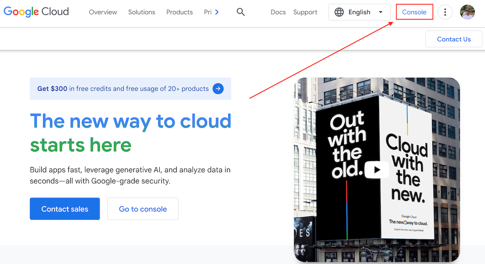
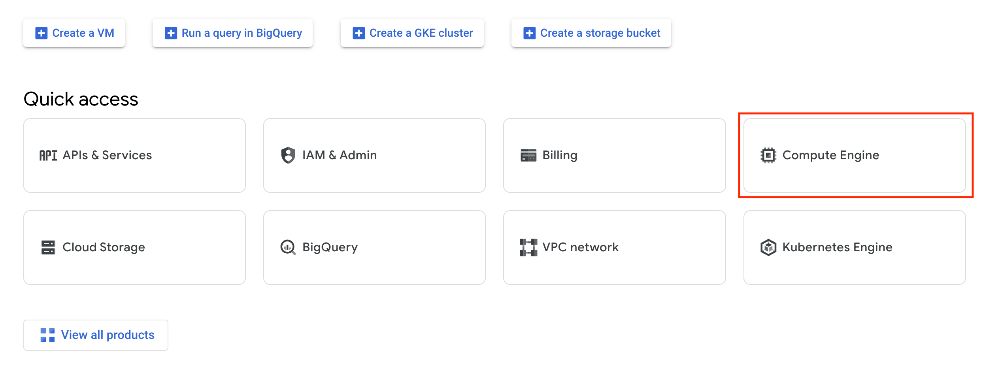
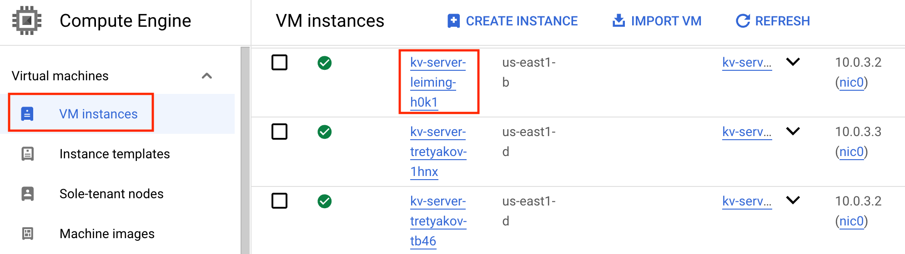
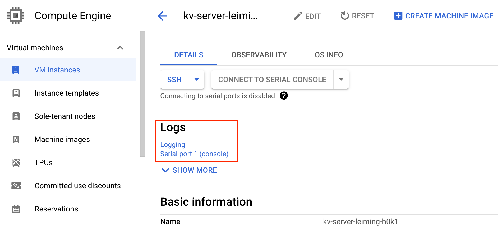
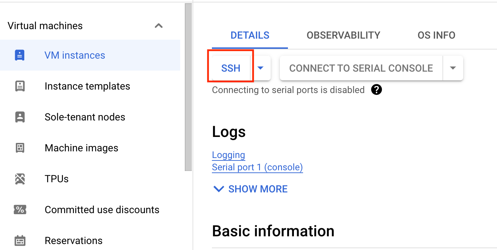

> FLEDGE has been renamed to Protected Audience API. To learn more about the name change, see the
> [blog post](https://privacysandbox.com/intl/en_us/news/protected-audience-api-our-new-name-for-fledge).

# FLEDGE Key/Value server deployment on GCP

This article is for adtech engineers who will set up the Google Cloud infrastructure and run the
Key/Value server for [FLEDGE](https://developer.chrome.com/docs/privacy-sandbox/fledge/) usage.

**Attention**: Currently, the GCP Key/Value server is intended to be called by the
[B&A services](https://github.com/privacysandbox/fledge-docs/blob/main/bidding_auction_services_api.md).
Please create a github issue if other use cases are needed (e.g., processing requests from
browsers).

To learn more about FLEDGE and the Key/Value server, take a look at the following documents:

-   [FLEDGE Key/Value server explainer](https://github.com/WICG/turtledove/blob/main/FLEDGE_Key_Value_Server_API.md)
-   [FLEDGE Key/Value server trust model](https://github.com/privacysandbox/fledge-docs/blob/main/key_value_service_trust_model.md)
-   [FLEDGE explainer](https://developer.chrome.com/en/docs/privacy-sandbox/fledge/)
-   [FLEDGE API developer guide](https://developer.chrome.com/blog/fledge-api/)

The instructions written in this document are for running a test Key/Value server that does not yet
have full privacy protection. The goal is for interested users to gain familiarity with the
functionality and high level user experience. As more privacy protection mechanisms are added to the
system, this document will be updated accordingly.

For the initial testing of the Key/Value server, you must have or
[create a Google Cloud Platform (GCP)](https://cloud.google.com/) account.

# Set up your GCP project

-   Install the [gcloud CLI](https://cloud.google.com/sdk/docs/install#deb) as it's a set of tools
    to create and manage Google Cloud resources.
-   Create a
    [project](https://cloud.google.com/resource-manager/docs/creating-managing-projects#gcloud).
    This may belong to an organization but can also be standalone. All work will proceed within a
    single project.
-   Create a [service account](https://cloud.google.com/iam/docs/service-account-overview). This
    should have the minimum role permissions required, but for testing purposes it is convenient to
    set it to roles/Editor. GCE instances rely on this service account to perform their operations.
    GCE instances rely on the IAM role of the service account for permissions.
-   Register a domain name via [Cloud Domains](https://cloud.google.com/domains/docs/overview) and a
    [Cloud DNS zone](https://cloud.google.com/dns/docs/overview/) for your domain.
-   Create a SSL certificate for the Global External Load Balancer as it only accepts TLS traffic
    from clients. From the external load balancer to the key/value server's envoy endpoint, another
    TLS session is required and we need to manually prepare a TLS certificate and a private key for
    this TLS session. Per
    [GCP's policy](https://cloud.google.com/load-balancing/docs/ssl-certificates/encryption-to-the-backends#secure-protocol-considerations),
    the certificate is not verified.

-   Create an [Artifact Registry](https://cloud.google.com/artifact-registry/docs) repository, then
    [authenticate your account](https://cloud.google.com/artifact-registry/docs/docker/pushing-and-pulling#cred-helper).
    You will build and upload the docker images used for testing.
-   Enable the following APIs:

```text
artifactregistry.googleapis.com
certificatemanager.googleapis.com
cloudapis.googleapis.com
cloudkms.googleapis.com
cloudtrace.googleapis.com
confidentialcomputing.googleapis.com
compute.googleapis.com
dns.googleapis.com
domains.googleapis.com
iamcredentials.googleapis.com
logging.googleapis.com
monitoring.googleapis.com
networkservices.googleapis.com
networkmanagement.googleapis.com
oslogin.googleapis.com
pubsub.googleapis.com
secretmanager.googleapis.com
servicemanagement.googleapis.com
staging-cloudkms.sandbox.googleapis.com
storage-api.googleapis.com
storage-component.googleapis.com
storage.googleapis.com
trafficdirector.googleapis.com
```

# Set up GCS bucket for Terraform states

Terraform state data can be stored into Google Cloud Storage (GCS) bucket, and the bucket must be
manually created first. Follow this
[official link](https://cloud.google.com/storage/docs/creating-buckets#storage-create-bucket-console)
to create a GCS bucket.

# Build the Key/Value server artifacts

OS: The current build process can run on Debian. Other OS may not be well supported at this moment.

Before starting the build process, install [Docker](https://docs.docker.com/engine/install/). If you
run into any Docker access errors, follow the instructions for
[setting up sudoless Docker](https://docs.docker.com/engine/install/linux-postinstall/#manage-docker-as-a-non-root-user).

## Get the source code from GitHub

The code for the FLEDGE Key/Value server is released on
[GitHub](https://github.com/privacysandbox/fledge-key-value-service).

The main branch is under active development. For a more stable experience, please use the
[latest release branch](https://github.com/privacysandbox/fledge-key-value-service/releases).

## Build the Docker image for GCP

From the Key/Value server repo folder, execute the following command:

prod_mode(default mode)

```sh
./production/packaging/gcp/build_and_test
```

nonprod_mode

```sh
./production/packaging/gcp/build_and_test --mode nonprod
```

This script will build a Docker image and store it locally under `/dist`.

Before uploading the image to your docker image repo, please specify an image tag for the docker
image, which would also be used later to identify your image on server start up.

```sh
export GCP_IMAGE_TAG=[[your gcp image tag]]
```

From the Key/Value server repo folder, execute the following command to tag your image and upload it
to your image repo:

```sh
./production/packaging/gcp/docker_push_gcp_repo --gcp-image-repo [[your GCP image repo]] --gcp-image-tag ${GCP_IMAGE_TAG}
```

where [[your GCP image repo]] should be the Artifact Registry you created earlier.

# Deployment

## Set up Terraform version

Use Terraform to deploy necessary resources to GCP and it's already loaded in
`builders/tools/terraform`. You only need to set the required Terraform version:

```sh
export TERRAFORM_VERSION=1.2.3
```

Feel free to add this script to `~/.bashrc` (or other shell config you use) for your convenience.

## Update Terraform configuration

For your Terraform configuration, you can use the template under
`production/terraform/gcp/environments/demo`. Copy the entire folder to another folder named with
your choice such as dev/staging/prod, name the files inside according to the region you want to
deploy to, and update the `[[REGION]].tfvars.json` with Terraform variables for your environment.
The description of each variable is described in
[GCP Terraform Vars doc](/docs/GCP_Terraform_vars.md).

Note that variable `tls_key` and `tls_cert` are not in `[[REGION]].tfvars.json`. Please supply these
with a `secrets.auto.tfvars` file under `production/terraform/gcp/environments/`.

Update the `[[REGION]].backend.conf`:

-   `bucket` - Set the bucket name that Terraform will use. The bucket was created in the previous
    [Set up GCS bucket for Terraform states](#set-up-gcs-bucket-for-terraform-states) step.
-   `prefix` - Set a path/to/directory to contain the Terraform state.

## Bidding and Auction services integration within the same VPC

If you're integrating with Bidding and Auction services (B&A), you are likely going to be reusing
the same VPC (virtual private cloud) and Service Mesh (internal LB).

Hence, you need to set these two parameters to true: `use_existing_service_mesh`,
`use_existing_vpc`.

You also need to set these parameters to proper values: `existing_service_mesh`, `existing_vpc_id`.
Example value:

`existing_service_mesh`: `projects/your-project/locations/global/meshes/your-mesh`
`existing_vpc_id`: `projects/your-project/global/networks/your-vpc`

Other things to keep in mind

-   CIDR range needs to be different for each server deployment (B&A, each kv). It is specified with
    `regions_cidr_blocks`
-   `enable_external_traffic` can be set to false. In this case, several other terraform vars can be
    [ignored](../GCP_Terraform_vars.md)
-   `regions_use_existing_nat` -- note that the NAT for each region can only be set up once under
    the same VPC. If a NAT has already been set up in an existing server deployment (by specifying
    an empty set of the `regions_use_existing_nat`), other sever deployments in the same region(s)
    need to specify the region(s) in the `regions_use_existing_nat` var.

## Apply Terraform

From the Key/Value server repo folder, run:

```sh
ENVIRONMENT=[[YOUR_ENVIRONMENT_NAME]]
REGION=[[YOUR_GCP_REGION]]
```

where `[[YOUR_ENVIRONMENT_NAME]]` should be the folder name you just created. Then, initialize the
Terraform configuration:

```sh
builders/tools/terraform -chdir=production/terraform/gcp/environments init --backend-config=${ENVIRONMENT}/${REGION}.backend.conf --var-file=${ENVIRONMENT}/${REGION}.tfvars.json --reconfigure
```

Generate/update GCP resources:

```sh
builders/tools/terraform -chdir=production/terraform/gcp/environments apply --var-file=${ENVIRONMENT}/${REGION}.tfvars.json
```

At the end, to destroy all the GCP resources:

```sh
builders/tools/terraform -chdir=production/terraform/gcp/environments destroy --var-file=${ENVIRONMENT}/${REGION}.tfvars.json
```

# Loading data into the server

Refer to the [FLEDGE Key/Value data loading guide documentation](/docs/data_loading/loading_data.md)
for loading data to be queried into the server.

# Common operations

## Access your GCP instances

You can access your GCP instances through [Google Cloud](https://cloud.google.com/) Console.



Go to Compute Engine.



Make sure `VM instances` is selected in the left panel. All VM instances under your project id are
listed to the right. Instances associated with your Kv-server have the name starting with
`kv-server-your_environment`, where `your_environment` is the environment variable you set in
`[[REGION]].tfvars.json`. Click the instance name for more details.



## Access server logs

In the instance details page, under `Logs`, you can access server logs in both `Logging` and
`Serial port (console)`. The `Logging` option is more powerful with better filtering and query
support on `Logs Explorer`.

The console log is located under resource type `VM Instance`. When server is running in prod mode,
the console log will not be available. However, if parameter `enable_otel_logger` is set to true, KV
server will export selective server logs to `Logs Explorer` under resource type `Generic Task`. More
details about logging in `prod mode` and `nonprod mode` in
.



## Query the server

Note that your server may need several minutes to fully rampup before starting to accept queries.

### Option 1: Via server URL

First, set your server url. This should correspond to the Terraform variable `server_url` that you
use when deploying GCP resources.

```sh
export GCP_SERVER_URL=your_url_here
```

Here we use grpcurl as an example tool to query the server. Please install grpcurl if you haven't
done so already.

```sh
curl -L https://github.com/fullstorydev/grpcurl/releases/download/v1.8.1/grpcurl_1.8.1_linux_x86_64.tar.gz | tar -xz
```

Query:

#### GetValues v1

```sh
./grpcurl -d '{"kv_internal":"hi"}' ${GCP_SERVER_URL}:443 kv_server.v1.KeyValueService.GetValues
```

#### GetValues v2

```sh
BODY='{ "metadata": { "hostname": "example.com" }, "partitions": [{ "id": 0, "compressionGroupId": 0, "arguments": [{ "tags": [ "custom", "keys" ], "data": [ "foo1" ] }] }] }'
```

```sh
./grpcurl -d '{"raw_body": {"data": "'"$(echo -n $BODY|base64 -w 0)"'"}}'  ${GCP_SERVER_URL}:443 kv_server.v2.KeyValueService/GetValuesHttp
```

### Option 2: Via service mesh

In short, service mesh is an internal load balancer. So, it is only available internally within a
VPC. The KV Server is set up with a service mesh as a backend service and we can query it internally
using proxyless gRPC. Normally, you would send proxyless gRPC queries from other internal servers
(e.g., a bidding server). For this demo, however, we are setting up a temporary server within the
same VPC and service mesh as the Kv-server for demonstration purposes.

First, in your local terminal, please set the environment parameter. This environment parameter
should be the same as the one in your terraform config.

```sh
export ENVIRONMENT=your_environment
```

Then, use the following command to set up a client VM within the same VPC network as your already
deployed KV Server. Note that you still need to manually replace `[[your_environment]]` at the end
of the script.

```sh
gcloud compute instances create ${ENVIRONMENT}-grpc-client   --network=kv-server-${ENVIRONMENT}-vpc --subnet=kv-server-${ENVIRONMENT}-us-east1-subnet  --zone=us-east1-b --tags=allow-ssh  --scopes=https://www.googleapis.com/auth/cloud-platform   --image-family=debian-10   --image-project=debian-cloud   --metadata-from-file=startup-script=<(echo '#! /bin/bash
set -e
export GRPC_XDS_BOOTSTRAP=/run/td-grpc-bootstrap.json
echo export GRPC_XDS_BOOTSTRAP=$GRPC_XDS_BOOTSTRAP | sudo tee /etc/profile.d/grpc-xds-bootstrap.sh
curl -L https://storage.googleapis.com/traffic-director/td-grpc-bootstrap-0.14.0.tar.gz | tar -xz
./td-grpc-bootstrap-0.14.0/td-grpc-bootstrap --config-mesh-experimental kv-server-[[your environment]]-mesh | tee $GRPC_XDS_BOOTSTRAP')
```

Note that if you are using an existing VPC and existing service_mesh instead of creating new
resources (you can do this by changing Terraform variables), please specify the existing VPC through
`--network=` and the existing service_mesh through `--config-mesh-experimental`.

Then, access the VM instance of this temporary server (`[[your environment]]-grcp-client`), and in
the details page, click `SSH` on top to access the terminal.



In the terminal of your grpc-client instance, run the following command to download and install the
grpcurl tool:

```sh
curl -L https://github.com/fullstorydev/grpcurl/releases/download/v1.8.1/grpcurl_1.8.1_linux_x86_64.tar.gz | tar -xz
```

#### GetValues v1

Run

```sh
./grpcurl --plaintext -d '{"kv_internal":"hi"}' xds:///kv-service-host kv_server.v1.KeyValueService.GetValues
```

#### GetValues v2

For GetValues v2, we need an api descriptor to parse query requests. The
'query_api_descriptor_set.pb' should already be built and moved under 'dist/' as you run the
following command earlier (from kv-server root repo, not from the grpc-client instance)

```sh
./production/packaging/gcp/build_and_test
```

No need to run it again if you have already `build_and_test` on the latest branch.

Now, from the grpc-client instance, make a `dist` directory in preparation to receive the
descriptor.

```sh
mkdir dist
```

Then, from the kv-server root repo, execute the following command to move the descriptor to the grpc
instance:

```sh
gcloud compute scp dist/query_api_descriptor_set.pb ${ENVIRONMENT}-grpc-client:dist/ --zone=us-east1-b
```

Finally, you can make the v2 query from the grpc-client instance:

```sh
BODY='{ "metadata": { "hostname": "example.com" }, "partitions": [{ "id": 0, "compressionGroupId": 0, "arguments": [{ "tags": [ "custom", "keys" ], "data": [ "foo1" ] }] }] }'
```

```sh
./grpcurl --plaintext --protoset dist/query_api_descriptor_set.pb -d '{"raw_body": {"data": "'"$(echo -n $BODY|base64 -w 0)"'"}}' xds:///kv-service-host kv_server.v2.KeyValueService/GetValuesHttp
```

At the end, remember to delete your grcp-client instance

```sh
gcloud compute instances delete ${ENVIRONMENT}-grpc-client --zone=us-east1-b
```

<!-- TODO(b/306641269): Add viewing telemetry guide here-->
