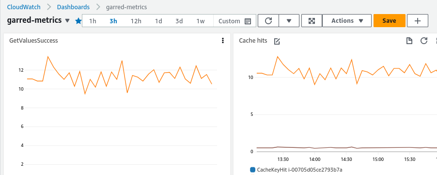

> FLEDGE has been renamed to Protected Audience API. To learn more about the name change, see the
> [blog post](https://privacysandbox.com/intl/en_us/news/protected-audience-api-our-new-name-for-fledge)

# FLEDGE K/V Server developer guide

## Repository set up

### Initialize and update submodules

Before using the repository, initialize the repo's submodules. Run:

```shell
git submodule update --init
```

The submodule content can be updated at any time using the following command.

```shell
git submodule update --remote --merge
```

## Data Server

The data server provides the read API for the KV service.

<!-- prettier-ignore-start -->
<!-- markdownlint-disable line-length -->
> Attention: The server can run locally (in or outside of Docker) while specifying `aws` as platform, in which case it will
> contact AWS based on the local AWS credentials. However, this requires the AWS environment to be
> set up first following the [AWS deployment guide](/docs/deploying_on_aws.md). You might need to
> set up the following parameters in the AWS System Manager:
>
> | Parameter Name                                           | Value                                                             |
> | -------------------------------------------------------- | ----------------------------------------------------------------- |
> | kv-server-local-data-bucket-id                           | Name of the delta file S3 bucket                                  |
> | kv-server-local-data-loading-file-channel-bucket-sns-arn | ARN of the Simple Notification Service (SNS) for the S3 bucket    |
> | kv-server-local-data-loading-realtime-channel-sns-arn    | ARN of the Simple Notification Service (SNS) for realtime updates |
> | kv-server-local-launch-hook                              | Any value, this won't be needed for                               |
>
> If you have a UDF delta file, you will also need to include it in your delta file S3 bucket. Refer to the [UDF Delta file documentation](./generating_udf_files.md) for how to generate a UDF delta file and upload it to S3 before starting the server.
<!-- markdownlint-enable line-length -->
<!-- prettier-ignore-end -->

### Prereqs

-   [Docker](https://docs.docker.com/get-docker/) on linux
-   Supported CPU architectures: AMD64, ARM64

### Run the server locally inside a docker container

1.  Build the image

    1. (Optional) If you need to make changes to code of a dependency repo:

        1. Note the path of the local repo
        1. Comment out the http_archive target in [WORKSPACE](/WORKSPACE) file (or a file loaded by
           it)
        1. Add a target in the WORKSPACE file:

            - [local_repository](https://bazel.build/reference/be/workspace#local_repository) if the
              directory tree has WORKSPACE and BUILD files
            - [new_local_repository](https://bazel.build/reference/be/workspace#new_local_repository)
              otherwise.

            Example (note, it must be added to the WORKSPACE file itself):

            ```bazel
            local_repository(
                name = "bazel_skylib",
                path = "/tmp/local_dependency/bazel_skylib",
            )
            ```

        1. Set environment variable to map the path for builds:

            ```sh
            export EXTRA_DOCKER_RUN_ARGS='--volume /tmp/local_dependency:/tmp/local_dependency'
            ```

    1. Build the server artifacts and copy them into the `dist/debian/` directory.

    ```sh
    builders/tools/bazel-debian run //production/packaging/aws/data_server:copy_to_dist --config local_instance --//:platform=aws
    ```

1.  Load the image into docker

    ```sh
    docker load -i dist/server_docker_image.tar
    ```

1.  Run the container. Port 50051 can be used to query the server directly through gRPC.
    --environment must be specified. The server will still read data from S3 and the server uses
    environment to find the S3 bucket. The environment is configured as part of the
    [AWS deployment process](/docs/deploying_on_aws.md).

    Set region. The region should be where your environment is deployed:

    ```sh
    export AWS_DEFAULT_REGION=us-east-1
    ```

To run the server by itself

```sh
docker run -it --rm --entrypoint=/init_server_basic --security-opt=seccomp=unconfined --env AWS_DEFAULT_REGION --env AWS_ACCESS_KEY_ID --env AWS_SECRET_ACCESS_KEY -p 127.0.0.1:50051:50051 bazel/production/packaging/aws/data_server:server_docker_image --port 50051 --environment=your_aws_environment
```

To start Envoy (required to test HTTP access) a similar pattern is used to build the image, load it
into docker and start a container. From the project root directory:

```sh
builders/tools/bazel-debian run //testing/run_local:build_envoy_image
docker load -i testing/run_local/dist/envoy_image.tar
docker run -it --rm --network host  bazel/testing/run_local:envoy_image
```

### Run the server locally

> Note: The server creates double forked processes. If you run the server locally outside of Docker,
> you will need to kill those processes separately.

For example:

```sh
builders/tools/bazel-debian run //components/data_server/server:server --config local_instance --//:platform=aws -- --environment="dev"
```

We are currently developing this server for local testing and for use on AWS Nitro instances
(similar to the
[Aggregation Service](https://github.com/google/trusted-execution-aggregation-service)). We
anticipate supporting additional cloud providers in the future.

### Interact with the server

-   Use `grpc_cli` to interact with your local instance. You might have to pass
    `--channel_creds_type=insecure`.

Example:

```sh
grpc_cli call localhost:50051 kv_server.v1.KeyValueService.GetValues \
  'kv_internal: "hi"' \
  --channel_creds_type=insecure
```

-   HTTP queries can also be used when
    [deployed in an AWS enclave](#develop-and-run-the-server-inside-aws-enclave) or with Envoy
    deployed alongside the server (see `docker-compose` instructions in
    [the section on running in a container](#run-the-server-locally-inside-a-docker-container)).

```sh
curl http://localhost:51052/v1/getvalues?kv_internal=hi
```

## Develop and run the server inside AWS enclave

The KV service instance should be set up by following the deployment guide
([AWS](/docs/deploying_on_aws.md)). For faster iteration, enclave image of the server is also
produced under `dist/`. Once the system has been started, iterating on changes to the server itself
only requires restarting the enclave image:

1. Copy the new enclave EIF to an AWS EC2 instance that supports nitro enclave. Note: The system has
   a SSH instance that a developer can access. From there the user can access actual server EC2
   instances, using the same SSH key. So the copy command below should be repeated twice to reach
   the destination EC2 instance.

    See
    [this doc](https://docs.aws.amazon.com/AWSEC2/latest/UserGuide/ec2-instance-connect-methods.html#ec2-instance-connect-connecting-aws-cli)
    for additional info

    Make sure you specify correct `availability-zone`.

    `ssh-public-key` should be pointing to your public key. See the doc above talking about how to
    generate it.

    ```sh
    aws ec2-instance-connect send-ssh-public-key --instance-id INSTANCE_ID --availability-zone us-east-1a --instance-os-user ec2-user --ssh-public-key file://keys/my_key.pub --region us-east-1
    ```

    After the command above you have 60 seconds to run this command.

    The EC2_ADDR for scp'ing from the public internet to ssh instance is the Public IPv4 DNS, e.g.,
    `ec2-3-81-186-232.compute-1.amazonaws.com` and for scp'ing from ssh instance to server instance
    is the Private IP DNS name e.g., `ip-10-0-226-225.ec2.internal`

    `./keys/my_key` here points to your private key.

    (If the command fails, ssh to your instance and make sure `ec2-user` owns the directtory you're
    trying to write in, e.g. run `chown ec2-user /home/ec2-user`)

    ```sh
    scp -o "IdentitiesOnly=yes" -i ./keys/my_key ./kv-server/dist/aws/server_enclave_image.eif ec2-user@{EC2_ADDR}:/home/ec2-user/server_enclave_image.eif
    ```

    Finally, you can ssh to the machine. You might need to `send-ssh-public-key` again.

    ```sh
    ssh -o "IdentitiesOnly=yes" -i ./keys/my_key ec2-user@{EC2_ADDR}
    ```

1. Start the enclave job (If one is running, terminate it first, see below for instructions):

    ```sh
    nitro-cli run-enclave --cpu-count 2 --memory 30720 --eif-path server_enclave_image.eif --debug-mode --enclave-cid 16
    ```

1. To see logs of the TEE job:

    ```sh
    ENCLAVE_ID=$(nitro-cli describe-enclaves | jq -r ".[0].EnclaveID"); [ "$ENCLAVE_ID" != "null" ] && nitro-cli console --enclave-id ${ENCLAVE_ID}
    ```

1. To terminate the job:

    ```sh
    ENCLAVE_ID=$(nitro-cli describe-enclaves | jq -r ".[0].EnclaveID"); [ "$ENCLAVE_ID" != "null" ] && nitro-cli terminate-enclave --enclave-id ${ENCLAVE_ID}
    ```

### Specifying platform specific src/dep

It's possible to use polymorphism + build-time flag to only build and link code specific to a
platform.

Example:

```build
cc_library(
    name = "blob_storage_client",
    srcs = select({
        "//:aws_platform": ["blob_storage_client_s3.cc"],
    }),
    hdrs = [
        "blob_storage_client.h",
    ],
    deps = select({
        "//:aws_platform": ["@aws_sdk_cpp//:s3"],
    }) + [
        "@com_google_absl//absl/status",
        "@com_google_absl//absl/status:statusor",
    ],
)
```

Available conditions are:

-   //:aws_platform
-   //:local_platform

Depending on which platform the server is being run on, you will want to specify the platform.

-   //:aws_instance
-   //:local_instance

There are two options for OpenTelemetry export when `//:local_instance` is specified:

-   //components/telemetry:local_otel_export=ostream [default]
-   //components/telemetry:local_otel_export=otlp

When otlp is specified, run a local instance of [Jaeger](https://www.jaegertracing.io/) to capture
telemetry.

### Running the server with Jaeger locally in Docker

To export telemetry to Jaeger from within a local Docker container,

1. Start a local instance of [Jaeger](https://www.jaegertracing.io/docs/1.42/getting-started/)

2. Follow the instructions on running the server in docker. For the `docker run` command, pass the
   flags `--network host --add-host=host.docker.internal:host-gateway`:

```sh
docker run -it --rm --network host --add-host=host.docker.internal:host-gateway --entrypoint=/init_server_basic --security-opt=seccomp=unconfined --env AWS_DEFAULT_REGION --env AWS_ACCESS_KEY_ID --env AWS_SECRET_ACCESS_KEY -p 127.0.0.1:50051:50051 bazel/production/packaging/aws/data_server:server_docker_image --port 50051 --environment=your_aws_environment
```

### Modifying CloudWatch dashboard

Each environment has a dashboard configured in AWS CloudWatch that is created via a Terraform
script.

Example dashboard:



The dashboard layout is specified via the `dashboard_body` parameter in the `environment_dashboard`
Terraform resource. This is a
[JSON configuration](https://docs.aws.amazon.com/AmazonCloudWatch/latest/APIReference/CloudWatch-Dashboard-Body-Structure.html)
that can be manually edited, but for larger edits the Cloudwatch console may be used to build this.

To edit:

1. Open an environment dashboard and edit the widgets as desired.
2. At the top right, save the dashboard.
3. From the 'Actions' dropdown, select _View/edit source_.
4. A pop-up will appear, click the _Copy source_ button at the top.
5. Paste this as the `dashboard_body` value in the Terraform dashboard script.
6. In the new JSON, replace the current environment name everywhere with `${var.environment}`
