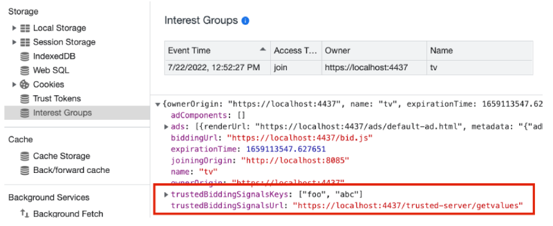
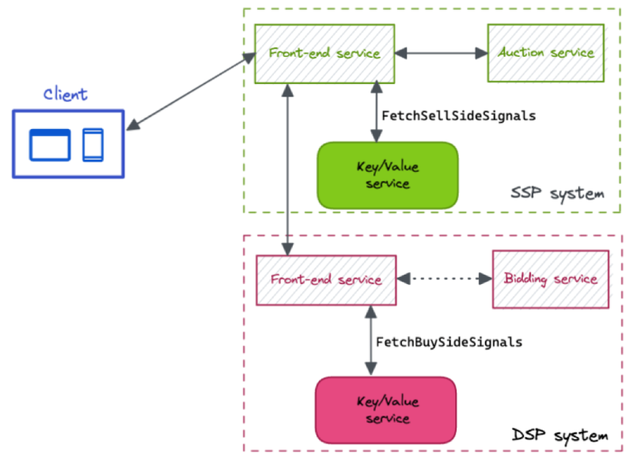

> FLEDGE has been renamed to Protected Audience API. To learn more about the name change, see the
> [blog post](https://privacysandbox.com/intl/en_us/news/protected-audience-api-our-new-name-for-fledge)

# Integrating the Key/Value server with FLEDGE

FLEDGE is a proposed API intended to serve remarketing ads without the usage of third party
identifiers such as cookies or AdIDs. FLEDGE facilitates the auction between the buyers and the
sellers, and when the auction executes, the Chrome or Android client will call the Key/Value server
to retrieve real-time data.

There are two Key/Value server modes for FLEDGE: demand-side platform (DSP) and sell-side platform
(SSP). The DSP Key/Value server is called during bid time and the SSP Key/Value server is called
during ad score time.

On Chrome and Android, FLEDGE and Key/Value server integration involves general steps listed below:

1. Configure the interest group and add users.
    1. Set the DSP Key/Value server URL as `trustedBiddingSignalsUrl`.
    2. Set the keys to be queried as `trustedBiddingSignalsKeys`.
2. Configure the auction. 3. Set the SSP Key/Value server URL as `trustedScoringSignalsUrl`.
3. Execute the auction. 4. The values for `trustedBiddingSignals` are available in the
   `generateBid()` function for the buyers. 5. The values for `trustedScoringSignals` are available
   in the `scoreAd()` function for the sellers.

The following sections describe platform-specific instructions.

# Chrome integration

## Integrate with the DSP Key/Value server

The DSP Key/Value server is registered when a user is added to an
[interest group](https://developer.chrome.com/blog/fledge-api/#joinadinterestgroup). The Key/Value
server URL is set as `trustedBiddingSignalsUrl` and the queried keys are set as
`trustedBiddingSignalsKeys` as properties in the
[interest group object](https://developer.chrome.com/blog/fledge-api/#interest-group-properties).

For example:

```js
// const customAudience for Android
const interestGroup = {
    owner: 'https://dsp.example',
    trustedBiddingSignalsUrl: 'https://dsp.example/kv/v1/getvalues',
    trustedBiddingSignalsKeys: ['key1', 'key2'],
    // ...and other interest group properties
};

navigator.joinAdInterestGroup(interestGroup, 7 * kSecsPerDay);
```

The ad interest group properties can be inspected in DevTools. Open the **Application** tab and
select **Interest Group** from the sidebar.



When the auction is executed at a later time, the browser will use the keys defined when the user
was added to an interest group to query the Key/Value server. The trusted bidding signal values will
be available to the [bidding function](https://developer.chrome.com/blog/fledge-api/#generatebid)
when the [auction is executed](https://developer.chrome.com/blog/fledge-api/#ad-auction) by the
seller.

The values will be in the `trustedBiddingSignals` of the `generateBid()` function:

```js
generateBid(interestGroup, auctionSignals, perBuyerSignals, trustedBiddingSignals, browserSignals) {
  const {key1, key2} = trustedBiddingSignals['keys'];

  return {
    // ...
   };
}
```

## Integrate with the SSP Key/Value server

The SSP Key/Value server is registered when the
[auction is executed](https://developer.chrome.com/blog/fledge-api/#ad-auction). The SSP Key/Value
server URL is set as `trustedScoringSignalsUrl` in the
[auction config](https://developer.chrome.com/blog/fledge-api/#auctionconfig-properties).

```js
const auctionConfig = {
    seller: 'https://ssp.example',
    trustedScoringSignalsUrl: 'https://ssp.example/scoring-signal/v1/getvalues',
    // ...and other auction config properties
};

const auctionResult = await navigator.runAdAuction(auctionConfig);
```

When the auction is executed, the browser calls the SSP Key/Value server with the render URL of each
creative in the ad interest group to retrieve the trusted scoring signals. The seller can use the
trusted scoring signals to make a decision about which ad to render to the user. The values from the
SSP Key/Value server will be available in the `scoreAd()` function:

```js
scoreAd(adMetadata, bid, auctionConfig, trustedScoringSignals, browserSignals) {
  const {renderUrl1, renderUrl2} = trustedScoringSignals['renderUrls'];

  return desirabilityScoreForThisAd;
}
```

# Android Integration

## Integrate with the DSP Key/Value server

The DSP Key/Value server is registered when a user is added to a custom audience. The Key/Value
server URL is set using the fields `trustedBiddingUri` and the keys using `trustedBiddingKeys` in
the `trustedBiddingData` property of the custom audience object.

```java
CustomAudience customAudience = return new CustomAudience.Builder()
    .setOwnerPackageName(Context.getApplicationContext().getPackageName())
    .setBuyer("buyer")
    .setName("name")
    // ...
    .setTrustedBiddingData(
        new TrustedBiddingData.Builder()
            .setTrustedBiddingUri("https://dsp.example/kv/v1/getvalues")
            .setTrustedBiddingKeys(ImmutableList.of("key1", "key2"))
            .build())
    .build();

final ListenableFuture<Object> joinCaFuture =  
          customAudienceClient.joinCustomAudience(customAudience);

joinCaFuture.addListener(() -> {
    //handle success or failure in joining CA
});
```

## Integrate with the SSP Key/Value server

The SSP Key Value server is registered when an ad selection is initiated. It should be set in the
AdSelectionConfig object used to configure the selectAds function.

```java
AdSelectionConfig myAdSelectionConfig = new AdSelectionConfig.Builder()
    .setSeller("example-ssp1.com")
    .setDecisionLogicURI(Uri.parse("https://..."))
    .setTrustedScoringSignalsURi(
        Uri.parse("https://ssp.example/scoring-signal/v1/getvalues"))
    .setCustomAudienceBuyers(
        ImmutableList.of("example-dsp1.com","bexample-dsp2.com")),
    .setAdSelectionSignals("{\"min_price\": 10,\"auction_attempts\": 3}")
    .setSellerSignals("{\"seller_type\": \"news\", " +
        "\"content_category\": \"sports"," +
        "\"mature_ads_accepted\" :\"false\"}")
    .setPerBuyerSignals(ImmutableMap.of(
        "buyer1Name", AdSelectionSignals.fromString("{"key1" : "value1"}"),
        "buyer2Name" , AdSelectionSignals.fromString("{\"key1\" : \"value1\", \"key2\" : \"value2\" }"))
    .build();

// Invoke ad services API to initiate ad selection workflow.
ListenableFuture<AdSelectionOutcome> adSelectionOutcomeFuture =
    adSelectionClient.selectAds(myAdSelectionConfig);

adSelectionOutcomeFuture.addListener(() -> {
    // Handle result
});
```

When the auction is executed, the browser calls the SSP Key/Value server with the render URL of each
creative in the ad interest group to retrieve the trusted scoring signals. The seller can use the
trusted scoring signals to make a decision about which ad to render to the user. The values from the
SSP Key/Value server will be available in the `scoreAd()` function:

```js
scoreAd(adMetadata, bid, adSelectionConfig, sellerSignals, trustedScoringSignals,
        contextualSignals, customAudienceSignals) {
  const {renderUrl1, renderUrl2} = trustedScoringSignals['renderUrls'];

  return desirabilityScoreForThisAd;
}
```

# Bidding and Auction Services with Key-Value Integration



Bidding & Auction services is a way to allow FLEDGE computation to take place on cloud servers in a
trusted execution environment, rather than running locally on a user's device. Bidding & Auction
system include:

-   BuyerFrontEnd service and Bidding service operated by Buyer / DSP. BuyerFrontend service will
    send RPC to DSP Key/Value service to fetch real-time bidding signals.
-   SellerFrontEnd service and Auction service operated by Seller / SSP. SellerFrontend service will
    send RPC to SSPKey/Value service to fetch real-time scoring signals.
