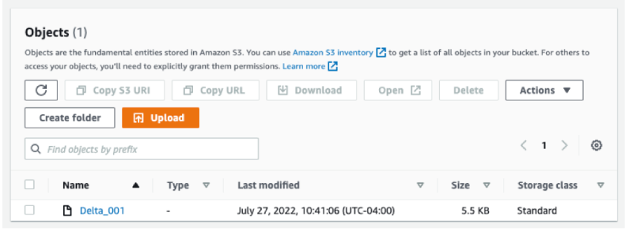

# Load data into the FLEDGE Key/Value server

The FLEDGE Key/Value server is used to send real-time signals to the buyers and the sellers during a
FLEDGE auction. The server reads files from a cloud file storage service. This doc explains the
expected file format, and processes to perform the common data loading operations:

-   For simple testing, you can use the sample data generator provided.
-   To actually integrate with your own data source, you will need to write C++ code. Use the sample
    data generator as an example reference.
-   The data generation part is a general process that applies to all cloud providers, but the
    uploading instructions are for AWS only.

# Data file

Data is consumed as delta. Newer data read will overwrite the key-value pair, if one already exists.

# Delta file name format

Delta file name must conform to the regular expression "DELTA\_\d{16}". See public/constants.h for
the most up-to-date format.

# Experimenting with sample data

## Generate sample data

A tool is available to generate sample data in [Riegeli](https://github.com/google/riegeli) format.
From the repo base directory, run:

```sh
> ./tools/serving_data_generator/generate_test_riegeli_data
```

Confirm that the sample data file `riegeli_data` has been generated.

## Upload sample data to AWS

The server watches an S3 bucket for new files. The bucket name is provided by you in the Terraform
config and is globally unique.

You can use the AWS CLI to upload the sample data to S3, or you can also use the UI.

```sh
> S3_BUCKET="[[YOUR_BUCKET]]"
> aws s3 cp riegeli_data s3://${S3_BUCKET}/DELTA_001
```

> Cauition: The filename must start with `DELTA_` prefix, followed by a 16-digit number.

Confirm that the file is present in the S3 bucket:



# Integration

## Integrating file generation with your data source

Today only C++ is supported to generate real data. The file format is
[Riegeli](https://github.com/google/riegeli). The actual data record is in
[Flatbuffers](https://google.github.io/flatbuffers/) format.

To generate the data:

1. Use `public/data/records_utils.h` library to create the Flatbuffers record.
2. Use Riegeli libraries to write the records to a file. The file must contain metadata in the
   format of `public/data_loading/riegeli_metadata.proto`. The code from
   `tools/serving_data_generator/test_serving_data_generator.cc` can be used as a good reference on
   how to write the file.

## Integrating file uploading with your data source for AWS

AWS provides libraries to communicate with S3, such as the
[C++ SDK](https://aws.amazon.com/sdk-for-cpp/). As soon as a file is uploaded to a watched bucket it
will be read into the service, assuming that it has a higher logical commit timestamp.
