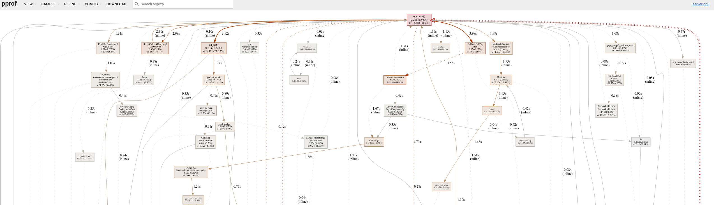
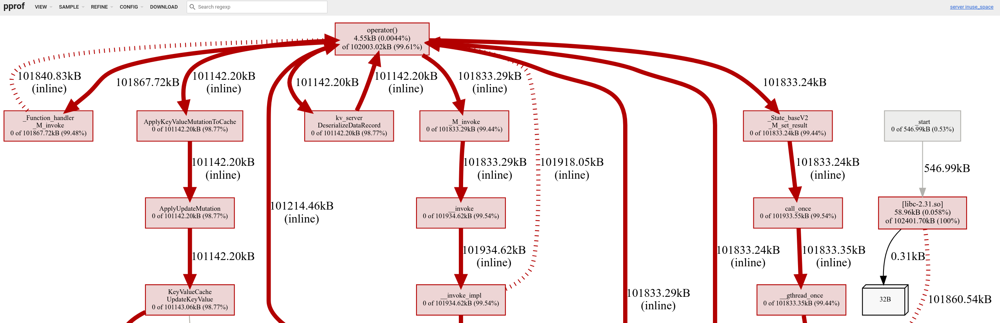

# Overview

This doc describes how to generate and visualize cpu and memory profiles of the KV server using the
following tools:

-   [gperftools](https://github.com/gperftools/gperftools)
-   [linux perf](https://perf.wiki.kernel.org/index.php/Main_Page)
-   [google pprof](https://github.com/google/pprof)

# Building the server profiling image

We provide a bazel target
(`production/packaging/local/data_server:server_profiling_docker_image.tar`) that can be used to
build a server docker image with profiling tools mentioned above. To build this image, run the
following command from workspace root:

```bash
./builders/tools/bazel-debian build \
    --jobs=48 --show_progress \
    --dynamic_mode=off -c opt --copt=-gmlt \
    --copt=-fno-omit-frame-pointer \
    production/packaging/local/data_server:server_profiling_docker_image.tar \
    --config=local_instance --config=local_platform --config=nonprod_mode
```

The `--dynamic_mode=off -c opt --copt=-gmlt` flags are needed to generate a server binary that is
optimized but still contain symbol information. The `--copt=-fno-omit-frame-pointer` flag instructs
the compiler not to optimize away the frame pointer. The `--jobs=48 --show_progress` are completely
optional depending on personal preference.

After the build completes successfully, the generated docker image tar is located here:
`bazel-bin/production/packaging/local/data_server/server_profiling_docker_image.tar`. Load the
docker image using the following command:

```bash
docker load -i bazel-bin/production/packaging/local/data_server/server_profiling_docker_image.tar
```

# Some things to callout

-   The profiling process is very manual at the moment, but we are working on automating some parts
    of it.
-   The commands below assume that `/data`, `/data/realtime` and `/data/profiles` exist on the
    docker host, and delta and snapshot files used by the server must be in `/data`.

# Generating and visualize CPU profiles

**STEP 1:** Use the following command to run the server with CPU profiling configured:

```bash
docker run \
    -it --init --rm --name=server-profiling-container \
    --env CPUPROFILE=/data/profiles/server.cpu.prof \
    --env CPUPROFILESIGNAL=12 \
    --env LD_PRELOAD=/usr/lib/x86_64-linux-gnu/libprofiler.so \
    --volume=/data:/data \
    --network=host \
    --security-opt=seccomp=unconfined \
    --privileged=true \
    --cpus=4 \
    --entrypoint=/server \
    bazel/production/packaging/local/data_server:server_profiling_docker_image \
    --port 50051 -delta_directory=/data --realtime_directory=/data/realtime \
    --stderrthreshold=0
```

**STEP 2:** Run the following command to profile the server for 10 seconds and generate a CPU
profile:

```bash
CONTAINER_ID=$(docker ps --all --quiet --no-trunc --filter name=server-profiling-container);
docker exec -it $CONTAINER_ID \
    sh -c "killall -12 server && sleep 10 && killall -12 server"
```

This should generate a CPU profile under `/data/profiles/server.cpu.prof.0`. If you the command
again, it will create another profile under `/data/profiles/server.cpu.prof.1`, e.t.c.

**STEP 3:** Run the following command to visualize the profile using `pprof` web app:

```bash
docker run -it --rm \
    --volume=/data:/data \
    --network=host \
    --cpus=4 \
    --entrypoint=pprof \
    bazel/production/packaging/local/data_server:server_profiling_docker_image \
    --http=":" /server /data/profiles/server.cpu.prof.0
```

This should open an interactive `pprof` web app showing the CPU profile information. The image below
shows a sample of what the visualization should look like.



More detailed instructions on how to analyze CPU profiles are here:
[gperftools cpu profiles docs](https://gperftools.github.io/gperftools/cpuprofile.html).

# Generating and visualize heap profiles

**STEP 1:** Use the following command to run the server with memory profiling enabled:

```bash
docker run \
    -it --init --rm --name=server-profiling-container \
    --env HEAPPROFILE=/data/profiles/server.heap.hprof \
    --env CPUPROFILESIGNAL=12 \
    --env LD_PRELOAD=/usr/lib/x86_64-linux-gnu/libtcmalloc.so \
    --volume=/data:/data \
    --network=host \
    --security-opt=seccomp=unconfined \
    --privileged=true \
    --cpus=4 \
    --entrypoint=/server \
    bazel/production/packaging/local/data_server:server_profiling_docker_image \
    --port 50051 -delta_directory=/data --realtime_directory=/data/realtime \
    --stderrthreshold=0
```

The command above may generate a number of heap profiles during startup depending on how much data
needs to be loaded by the server. The
[gperftools heap profiling docs](https://gperftools.github.io/gperftools/heapprofile.html) has more
details on env variables that can be used to control the behavior of the heap profiler.

**STEP 2:** Run the following command to take a heap profile snapshot:

```bash
CONTAINER_ID=$(docker ps --all --quiet --no-trunc --filter name=server-profiling-container);
docker exec -it $CONTAINER_ID sh -c "killall -12 server"
```

**STEP 3:** Run the following command to visualize the profile using `pprof` web app.

```bash
docker run -it --rm \
    --volume=/data:/data \
    --network=host \
    --cpus=4 \
    --entrypoint=pprof \
    bazel/production/packaging/local/data_server:server_profiling_docker_image \
    --http=":" /server /data/profiles/server.heap.hprof.0001.heap
```

This should open an interactive `pprof` web app showing the heap profile information. The image
below shows a sample of what the visualization should look like.



More detailed instructions on how to analyze heap profiles are here:
[gperftools heap profiles docs](https://gperftools.github.io/gperftools/heapprofile.html).

# Profiling using linux perf

## Example 1: Sampling CPU events

To list all events supported by `perf`, run the following command:

```bash
CONTAINER_ID=$(docker ps --all --quiet --no-trunc --filter name=server-profiling-container);
docker exec --env SERVER_PID -it $CONTAINER_ID sh -c "linux-perf list"
```

This will produce the following output:

```bash
List of pre-defined events (to be used in -e):

  branch-instructions OR branches                    [Hardware event]
  branch-misses                                      [Hardware event]
  bus-cycles                                         [Hardware event]
  cache-misses                                       [Hardware event]
  cache-references                                   [Hardware event]
  cpu-cycles OR cycles                               [Hardware event]
  instructions                                       [Hardware event]
  ref-cycles                                         [Hardware event]

  alignment-faults                                   [Software event]
  bpf-output                                         [Software event]
  context-switches OR cs                             [Software event]
  ...
```

**STEP 1:** Run the server (note that we don't need to configure gperftools here):

```bash
docker run \
    -it --init --rm --name=server-profiling-container \
    --volume=/data:/data \
    --network=host \
    --security-opt=seccomp=unconfined \
    --privileged=true \
    --cpus=4 \
    --entrypoint=/server \
    bazel/production/packaging/local/data_server:server_profiling_docker_image \
    --port 50051 -delta_directory=/data --realtime_directory=/data/realtime \
    --stderrthreshold=0
```

**STEP 2:** Run the following command to grap the PID of the server process running inside the
profiling container:

```bash
CONTAINER_ID=$(docker ps --all --quiet --no-trunc --filter name=server-profiling-container);
docker exec -it $CONTAINER_ID sh -c "pidof server"
```

**STEP 3:** Run the following commands to sample cpu events over a 10 second interval:

```bash
CONTAINER_ID=$(docker ps --all --quiet --no-trunc --filter name=server-profiling-container);
docker exec -it $CONTAINER_ID sh -c "linux-perf stat -a --pid=<SERVER_PID> sleep 10"
```

Depending on your system and the type of PMU counters supported, you will see something along the
lines of the following output:

```bash
 Performance counter stats for process id '7':

            153.61 msec cpu-clock                 #    0.015 CPUs utilized
              4336      context-switches          #    0.028 M/sec
                30      cpu-migrations            #    0.195 K/sec
                 0      page-faults               #    0.000 K/sec
         143444923      cycles                    #    0.934 GHz
          39235995      instructions              #    0.27  insn per cycle
           8348616      branches                  #   54.351 M/sec
            953587      branch-misses             #   11.42% of all branches

      10.005084345 seconds time elapsed
```

**STEP 4:** Run the following to count CPU cache events during a 10 second period:

```bash
CONTAINER_ID=$(docker ps --all --quiet --no-trunc --filter name=server-profiling-container);
docker exec --env SERVER_PID -it $CONTAINER_ID \
    sh -c "linux-perf stat -e dTLB-loads,dTLB-load-misses,L1-dcache-loads,L1-dcache-load-misses,LLC-loads,LLC-load-misses --pid=<SERVER_PID> sleep 10"
```

This should produce the following output (asuming the events are supported on your system):

```bash
Performance counter stats for process id '7':

           9677890      dTLB-loads                                                    (74.60%)
            243375      dTLB-load-misses          #    2.51% of all dTLB cache hits   (73.26%)
           9664552      L1-dcache-loads                                               (66.94%)
           2041239      L1-dcache-load-misses     #   21.12% of all L1-dcache hits    (68.91%)
           1204885      LLC-loads                                                     (58.46%)
             20911      LLC-load-misses           #    1.74% of all LL-cache hits     (57.83%)

      10.004671430 seconds time elapsed
```

# Known issues

## Issue 1: Symbol resolution fails for system libraries

Profile dumps generated in examples above are also available for analysis on the host machine under
`/data/profiles/*`. However, symbol resolution for shared libraries does not quite work so you will
see the following errors when running `pprof` on the host machine:

```bash
Local symbolization failed for libpthread-2.31.so (build ID f5b7b9b3efe01ef7aec691dc8f4e272c518f8cdf): stat /usr/lib/x86_64-linux-gnu/libpthread-2.31.so: no such file or directory
Local symbolization failed for libc-2.31.so (build ID e678fe54a5d2c2092f8e47eb0b33105e380f7340): stat /usr/lib/x86_64-linux-gnu/libc-2.31.so: no such file or directory
Local symbolization failed for libstdc++.so.6.0.28 (build ID fcd5414020056f1d95855868e00f3a7d479630fd): stat /usr/lib/x86_64-linux-gnu/libstdc++.so.6.0.28: no such file or directory
Local symbolization failed for ld-2.31.so: stat /usr/lib/x86_64-linux-gnu/ld-2.31.so: no such file or directory
Some binary filenames not available. Symbolization may be incomplete.
Try setting PPROF_BINARY_PATH to the search path for local binaries.
```

# Troubleshooting

## Error: "Input perf.data has no sample events."

This error means that the generated profile file has no profile information which can happen when
PMU counters are completely disabled on the host machine. Unfortunately, the fix or workaround fix
depends on why `perf` profiling is not working on the host.
