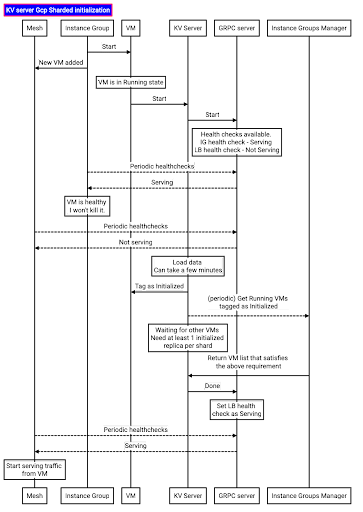
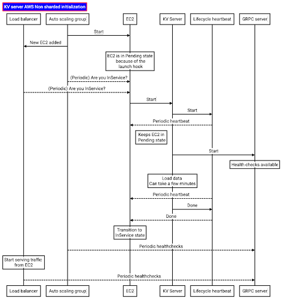
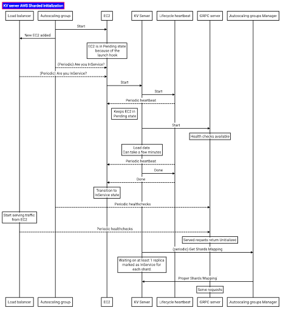

# KV server initialization state transition

Sequence diagrams below outline initilization steps for AWS/GCP Sharded/Non sharded configurations.

## GCP

### Non sharded

### Sharded

## AWS

### Non sharded

### Sharded

<!-- copybara:strip_begin(internal bookkeeping) -->
<!-- prettier-ignore-start -->
<!-- mdformat off(sequence diagram format) -->
<!-- markdownlint-disable ol-prefix -->
<https://sequencediagram.googleplex.com/>
1.

Title: KV server AWS Non sharded initialization [fontcolor="white", fillcolor="blue", color="red"]

participant Load balancer as Lb
participant Auto scaling group as A
participant EC2 as E
participant KV Server as K
participant Lifecycle heartbeat as L
participant GRPC server as G

A->E: Start
A->Lb: New EC2 added
Note over E: EC2 is in Pending state\n because of the\n launch hook
A-->E: (Periodic) Are you InService?
Lb-->E: (Periodic) Are you InService?
E->K: Start
K->L: Start
L-->E: Periodic heartbeat
Note right of E: Keeps EC2 in\n Pending state
K->G: Start
Note over G: Health checks available
Note over K: Load data \n Can take a few minutes
L-->E: Periodic heartbeat
K->L: Done
L-->E: Done
Note over E: Transition to \n InService state
A-->G: Periodic healthchecks
Note over Lb: Start serving traffic \n from EC2
Lb-->G: Periodic healthchecks

2.

Title: KV server AWS Sharded initialization [fontcolor="white", fillcolor="blue", color="red"]

participant Load balancer as Lb
participant Autoscaling group as A
participant EC2 as E
participant KV Server as K
participant Lifecycle heartbeat as L
participant GRPC server as G
participant Autoscaling groups Manager as AM

A->E: Start
A->Lb: New EC2 added
Note over E: EC2 is in Pending state\n because of the\n launch hook
A-->E: (Periodic) Are you InService?
Lb-->E: (Periodic) Are you InService?
E->K: Start
K->L: Start
L-->E: Periodic heartbeat
Note right of E: Keeps EC2 in\n Pending state
K->G: Start
Note over G: Health checks available
Note over K: Load data \n Can take a few minutes
L-->E: Periodic heartbeat
K->L: Done
L-->E: Done
Note over E: Transition to \n InService state
A-->G: Periodic healthchecks
Note over Lb: Start serving traffic \n from EC2
Lb-->G: Periodic healthchecks
Note over G: Served requets return Unitialized
K->AM: (periodic) Get Shards Mapping
Note over K: Waiting on at least 1 replica \n marked as InService for \n each shard.
AM->K: Proper Shards Mapping
Note over G: Serve requests

3.

Title: KV server Gcp Non Sharded initialization [fontcolor="white", fillcolor="blue", color="red"]

participant Mesh as Lb
participant Instance Group as A
participant VM as E
participant KV Server as K
participant GRPC server as G

A->E: Start
A->Lb: New VM added
Note over E: VM is in Running state
E->K: Start
K->G: Start
Note over G: Health checks available. \n IG health check - Serving \n LB health check - Not Serving
A-->G: Periodic healthchecks
G-->A: Serving
Note over A: VM is healthy \n I won't kill it.
Lb-->G: Periodic healthchecks
G-->Lb: Not serving
Note over K: Load data \n Can take a few minutes
K->G: Done
Note over G: Set LB health \n check as Serving
Lb-->G: Periodic healthchecks
G-->Lb: Serving
Note over Lb: Start serving traffic \n from VM

4.

Title: KV server Gcp Sharded initialization [fontcolor="white", fillcolor="blue", color="red"]

participant Mesh as Lb
participant Instance Group as A
participant VM as E
participant KV Server as K
participant GRPC server as G
participant Instance Groups Manager as IM

A->E: Start
A->Lb: New VM added
Note over E: VM is in Running state
E->K: Start
K->G: Start
Note over G: Health checks available. \n IG health check - Serving \n LB health check - Not Serving
A-->G: Periodic healthchecks
G-->A: Serving
Note over A: VM is healthy \n I won't kill it.
Lb-->G: Periodic healthchecks
G-->Lb: Not serving
Note over K: Load data \n Can take a few minutes
K->E: Tag as Initialized
K-->IM: (periodic) Get Running VMs \n tagged as Initialized
Note over K: Waiting for other VMs \n Need at least 1 initialized \n replica per shard
IM->K: Return VM list that satisfies \n the above requirement
K->G: Done
Note over G: Set LB health \n check as Serving
Lb-->G: Periodic healthchecks
G-->Lb: Serving
Note over Lb: Start serving traffic \n from VM
<!-- markdownlint-enable ol-prefix -->
<!-- mdformat on -->
<!-- prettier-ignore-end -->
<!-- copybara:strip_end -->
