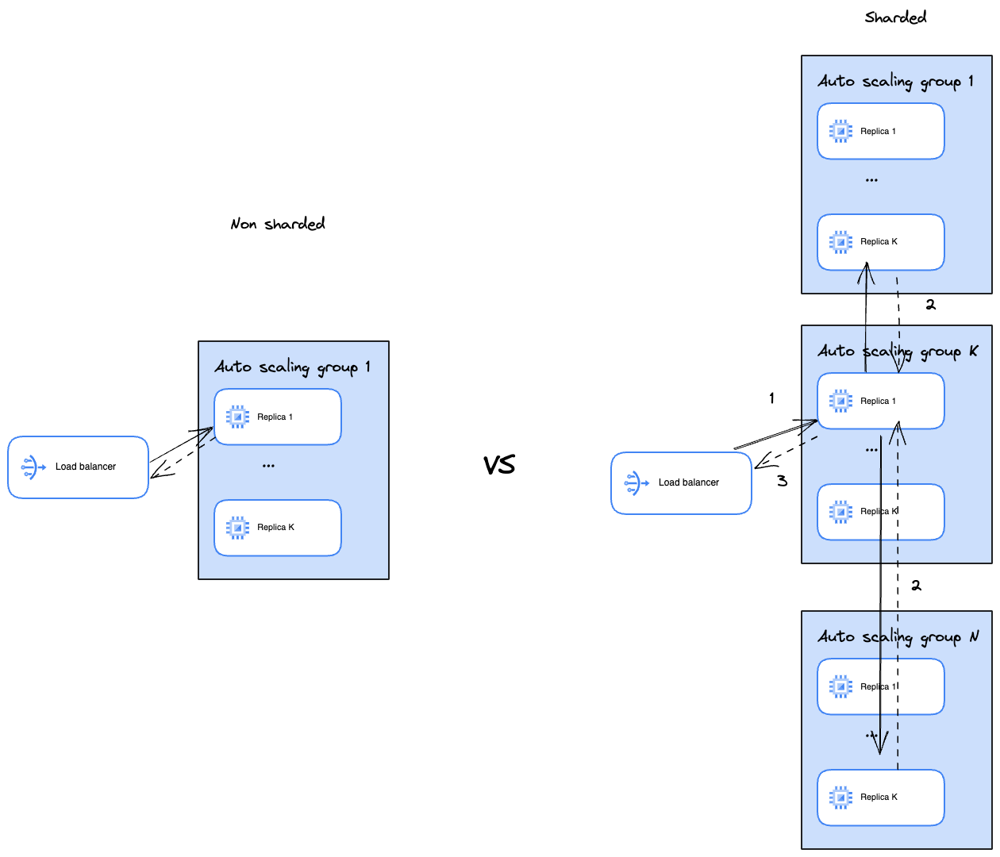
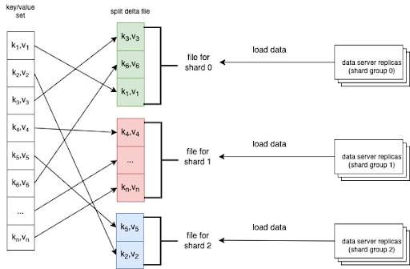

# Overview

Please take a look at this
[explainer](https://github.com/privacysandbox/fledge-docs/blob/main/key_value_service_sharding.md)
for additional background on sharding.

## What is sharding?

Sharding allows splitting data in shards and having each server store only a piece of data. When the
retrieval happens all the relevant data is collected from corresponding shards.

## Key requirements

Sharding allows an AdTech to scale Key Value server to support arbitrarily large data sets. The
sharding concept is internal to the server side and the server operator. Devices and external
clients do not know that the service is sharded.

Sharding allows AdTechs to do it in a reliable way: high availability and data consistency is
preserved. It also allows to do it with minimal overhead:

-   sharding is optional
-   additional infrastructure complexity, cost and latency is kept to a minimum where possible

Lastly, sharding maintains the privacy requirements, where possible. See the linked doc above for
additional details.

Sharding can be turned on for AWS and GCP.

# Should I use sharding?

Key Value server stores an in-memory data set, because of TEE limitations. If your dataset is larger
than what can fit in a single machine's memory, you need to either pick a bigger machine or use
sharding. Naturally, if the size of your data set is bigger than the biggest machine's memory
capacity, your only option is to use sharding. Additionally, sometimes it is cheaper to use multiple
smaller machines, as compared to a few high capacity ones. The memory capacity of a single machine
depends on what you specify in the terraform variables
[file](https://github.com/privacysandbox/protected-auction-key-value-service/blob/04d3e75794fadc14c17b960a9cd02088216aa138/production/terraform/aws/environments/demo/us-east-1.tfvars.json#L16).

E.g. the demo value is `m5.xlarge` for AWS, which
[is](https://aws.amazon.com/ec2/instance-types/m5/) 16 GB. Cloud providers give an ability to
natively monitor the amount of used memory. So if based on that metric or your calculations you
approach the limit, e.g. within 10%, you should consider this feature.

## Sharding constraints and trade offs

-   KV server does not support in-flight resharding. This feature will be added later. AdTechs can
    reshard by spinning up a parallel stack and rerouting traffic to it once it's ready to serve
    requests, or by taking the system down.
-   Sharding adds latency because an extra network hop has to be made.
-   Sharding adds extra CPU and network usage due to mechanisms that allows us to keep the read
    patterns private.
-   Extra usage or resources ultimately translates into higher maintenance cost.
-   Sharding makes system more complex and harder to reason about and debug
-   Sharding adds more components that can potentially fail

## AdTech sharding related responsibilities

To take advantage of sharding capabilities, an AdTech needs to update how they load data on the
[standard](#standard-path) and [realime](#relatime-update-path) updates. Please refer to each
section for more details.

Additionally, please refer to this [doc](./sharding_debugging.md) to see the additional metrics and
latencies you will need to monitor. The page also has a sample dashboard that you can use for that.

# How sharding affects the system

At a high level, sharding affects the [write](#write-path) path and [read](#read-path) path. Each is
described in more details below. In terms of resource footprint, as you can see below, in the
sharded case, N auto scaling groups are created, whereas in the non-sharded world only one is
created.



## Enabling sharding

The number of shards is controlled by the `num_shards`
([AWS](https://source.corp.google.com/h/team/kiwi-air-force-eng-team/kv-server/+/main:docs/AWS_Terraform_vars.md),[GCP](https://source.corp.google.com/h/team/kiwi-air-force-eng-team/kv-server/+/main:docs/GCP_Terraform_vars.md))
parameter.

If this parameter is not set or set to 1, then no additional cost associated with sharding is
incurred.

## Sharding function

[Sharding function](https://github.com/privacysandbox/protected-auction-key-value-service/blob/31e6d0e3f173086214c068b62d6b95935063fd6b/public/sharding/sharding_function.h#L32)
takes a key and maps it to a shard number. It is a
[SHA256](https://github.com/privacysandbox/protected-auction-key-value-service/blob/31e6d0e3f173086214c068b62d6b95935063fd6b/public/sharding/sharding_function.h#L35C38-L35C38)
mod `number of shards`.

## Write path

Data that doesn't belong to a given shard is dropped if it makes it to the server. There is a
[metric](https://github.com/privacysandbox/protected-auction-key-value-service/blob/31e6d0e3f173086214c068b62d6b95935063fd6b/components/data_server/data_loading/data_orchestrator.cc#L101C54-L101C54)
that an AdTech can track. Ideally, this metric should be 0.

Sharding helps limit the amount of data each server instance has to process on the write path. This
decreases server start time and operational costs (gCPU, RAM, etc).

### Standard path

An AdTech should group key/value pairs that belong to the same shard in a separate file. An AdTech
should use this [sharding function](#sharding-function) to calculate the shard number for a given
key. To load data, each data server replica finds the file for the shard that it's responsible for
and load it.



A snapshot/delta file indicates its shard number through this
[field](https://github.com/privacysandbox/protected-auction-key-value-service/blob/31e6d0e3f173086214c068b62d6b95935063fd6b/public/data_loading/riegeli_metadata.proto#L40).
This
[tool](https://github.com/privacysandbox/protected-auction-key-value-service/blob/252d361c7a3b291f50ffbf36d86fc4405af6a147/tools/serving_data_generator/test_serving_data_generator.cc#L36-L37)
shows how that field can be set. If it is not set, the whole file will be read by all machines.
However, only records that belong to that particular shard will be loaded in memory. If the shard
number in the file does not match the server's shard number, the server can skip the file without
reading the records.

### Relatime update path

A message published to SNS, for AWS, or PubSub, for GCP _must_ be tagged with a shard number.
SNS/PubSub will fan out such messages only
([AWS](https://github.com/privacysandbox/protected-auction-key-value-service/blob/31e6d0e3f173086214c068b62d6b95935063fd6b/components/data/common/msg_svc_aws.cc#L174),
[GCP](https://github.com/privacysandbox/protected-auction-key-value-service/blob/31e6d0e3f173086214c068b62d6b95935063fd6b/components/data/common/msg_svc_gcp.cc#L86))
to the machines that are associated with that shard number. This increases the throughput for any
given machine, as it has to process fewer messages and only relevant ones.

#### AWS CLI example:

```sh
aws sns publish --topic-arn "$topic_arn" --message "$file" --message-attributes '{"shard_num" : { "DataType":"String", "StringValue":"1"}}'
```

#### GCP CLI example:

```sh
gcloud pubsub topics publish "$pubsub" --message "$file" --attribute=shard_num=2
```

## Read path

Key lookup and running queries work the same from the point of view of the client, in the sharded
and non-sharded set up. In other words, the client does not need to know that the data is sharded,
or specify any extra information when reading keys.

This [diagram](#how-sharding-affects-the-system) should help to understand the flow better. When a
request comes in, it is randomly assigned to one of the servers. That server queries relevant keys
from relevant shards and then combines them together and returns the result to the UDF. Note that
some keys may be looked up in memory from that server.

If one of the downstream requests fails, a corresponding per key
[status](https://github.com/privacysandbox/protected-auction-key-value-service/blob/31e6d0e3f173086214c068b62d6b95935063fd6b/components/internal_server/sharded_lookup.cc#L85)
is set, which is different from `Not found`
[status](https://github.com/privacysandbox/protected-auction-key-value-service/blob/31e6d0e3f173086214c068b62d6b95935063fd6b/components/internal_server/sharded_lookup.cc#L72C24-L72C24).

Similarly, if a set query needs to be run, it will be run after corresponding sets have been
collected. However, if one of the downstream requests fails, then the whole query is failed.

Each machine knows its shard number. A machine isn't ready to serve traffic until it has discovered
at least one active replica for each shard cluster (from 1 to `num_shards`). That mapping from a
shard cluster number to internal ip addresses, preserved in memory for performance reasons, is
updated every
[`update_interval_millis`](https://github.com/privacysandbox/protected-auction-key-value-service/blob/31e6d0e3f173086214c068b62d6b95935063fd6b/components/sharding/cluster_mappings_manager.h#L48C30-L48C30).

When a request needs to be made to a shard cluster with K replicas, a machine is chosen
[randomly](https://github.com/privacysandbox/protected-auction-key-value-service/blob/31e6d0e3f173086214c068b62d6b95935063fd6b/components/sharding/shard_manager.cc#L91C45-L91C45)
from the pool.

## Privacy

In order not to reveal extra information about the read pattern, the following features were
implemented:

-   server to server communication is encrypted. Coordinators are used to retrieve private keys.
-   for any given kv server read request, downstream requests are always made to all shards. That is
    necessary to not reveal extra information about the looked up keys, as AdTechs know which keys
    live on which shards.
-   for any given kv server read request, when data shards are queried, the payloads of
    corresponding requests are of the same size, for the same reason.

## Machine sizes

### AWS

AWS has many different types of machines. However, an enclave can only run in a single NUMA cluster.
If a machine has many clusters, an enclave can only run in one of them. So it is advisable to choose
a machine with a single NUMA cluster to better utilize resources.

Unfortunately, the docs don't say how many NUMA clusters a machine has. And there is no API for it.
You can deploy a machine and using this
[link](https://repost.aws/knowledge-center/ec2-review-numa-statistics) see how many NUMA clusters it
has.

Even though there are machines available with up to 20 TB RAM, those machines have many NUMA
clusters in them. `r7i.24xlarge` or `r7a.24xlarge` has the biggest NUMA cluster of 768 GiB among EC2
machines that we are aware of.

That is effectively the upper bound, and actual amount of data you can store is smaller, since you
need space for OS and other things.

### GCP

GCP supports the
[following](https://cloud.google.com/confidential-computing/confidential-vm/docs/os-and-machine-type)
machine types. The one with the biggest amount of RAM is `n2d-standard-224` -- 896GB.

## Capability

KV server was tested on GCP with 10 TB of data loaded spread across 20 shards. Each shard had 3
replicas.

## Work in progress

[Logical Sharding Config](https://github.com/privacysandbox/protected-auction-key-value-service/blob/0e9b454825d641786255f11df4a2b62eee893a98/public/data_loading/riegeli_metadata.proto#L44)
is a work in progress and you should not be using it at the moment.
