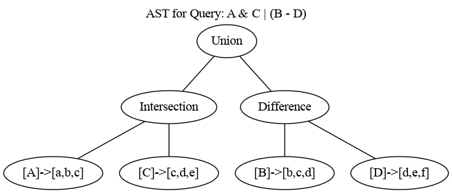

# Set query language

The K/V server supports a simple set query language that can be invoked using two UDF reap APIs (1)
`runQuery("query")` and `runSetQueryInt("query")`. The query language implements threee set
operations `union` denoted as `|`, `difference` denoted as `-` and `intersection` denoted as `&` and
queries use sets of strings and numbers as input.

As an example, suppose that we have indexed two sets of 32 bit integer ad ids targeting `games` and
`news` to the K/V server memory store. We can find the sets of ad ids targeting both `games` and
`news` by intersecting `games` and `news` sets using the following query in a UDF:
`games_and_news_ads = runSetQueryInt("games & news")`.

# Constructing queries

## Query operators

The set query language [grammar](/components/query/parser.yy) supports three binary operators:

-   `union` or `|` operator - e.g., given `A = [1, 2, 3]` and `B = [3, 4, 5]`, then
    `A | B = [1, 2, 3, 4, 5]`.
-   `difference` or `-` operator - e.g., given `A = [1, 2, 3]` and `B = [3, 4, 5]`, then
    `A - B = [1, 2]`
-   `intersection` or `&` operator - e.g., given `A = [1, 2, 3]` and `B = [3, 4, 5]`, then
    `A & B = [ 3 ]`

## Query operands

Queries support two types of sets as operands:

-   set of numbers - only 32 bit unsigned numbers are supported. The data loading type is
    `UInt32Set` in [data_loading.fbs](/public/data_loading/data_loading.fbs).
-   set of strings - arbitrary length UTF-8 or 7-bit ASCII strings are supported. The data loading
    type is `StringSet` in [data_loading.fbs](/public/data_loading/data_loading.fbs).

## Query syntax

Queries can be constructed using long form operator names (`union`, `difference`, `intersection`) or
short form operator symbols (`|`, `-`, `&`). By default, queries are evaluated left to right and one
can use paretheses to override default precedence, e.g., (1) `A & B - C` is semantically different
from (2) `A & (B - C)` because in (1), `A` is intersected with `B` and then `C` is subtracted from
the result whereas in (2) `A` is intersected with the result of finding the difference between `B`
and `C`.

Note that valid queries always have an operator between two operands. For example, given three sets
`A`, `B` and `C`, valid queries include `A | B & C`, `A - B - C`, `B & C - A`, but `A | B | C &` is
invalid because of the last `&`.

## Visualizing ASTs for queries

We provide a tool [query_toy.cc](/components/tools/query_toy.cc) that can be used to visualize AST
trees for queries. For example, run the following commands to evaluate and visualize the AST for
`A & B | (C - D)`:

```bash
./builders/tools/bazel-debian build -c opt //components/tools:query_toy &&
bazel-bin/components/tools/query_toy --query="A & C | (B - D)" --dot_path="$PWD/query.dot" &&
dot -Tpng query.dot > query.png
```

This produces the following image: 

# Running queries in UDFs

The K/V server supports two APIs for running queries inside UDFs.

-   `runQuery("query")`
    -   Takes a valid `query` as input and returns a set of strings.
    -   See [run_query_udf.js](/tools/udf/sample_udf/run_query_udf.js) for a JavaScript example.
-   `runSetQueryInt("query")`
    -   Takes a valid `query` as input and returns a byte array of serialized 32 bit usinged
        integers.
    -   See [run_set_query_int_udf.js](/tools/udf/sample_udf/run_set_query_int_udf.js) for a
        JavaScript example.

## Which API should I use, `runQuery` vs. `runSetQueryInt`?

`runSetQueryInt` implements a much more perfomant version of query evaluation based on bitmaps. So
if your sets can be represented as 32 bit unsigned integer sets and are relatively dense compared to
the range of numbers, then use `runSetQueryInt`. We also provide a benchmarking tool
[query_evaluation_benchmark](/components/tools/benchmarks/query_evaluation_benchmark.cc) that can be
used to determine whether using integer sets vs. string sets would be much more performant for a
given scenario. For example:

```bash
./builders/tools/bazel-debian run -c opt //components/tools/benchmarks:query_evaluation_benchmark -- \
    --benchmark_counters_tabular=true \
    --benchmark_time_unit=us \
    --set_size=500000 \
    --range_min=1000000 \
    --range_max=2000000 \
    --set_names="A,B,C,D" \
    --query="(A - B) | (C & D)"
```

benchamrks evaluating set operations and the query `(A - B) | (C & D)` using sets with 500,000
elements randomly selected from the range `[1,000,000 - 2,000,000]`. On my machine, the benchmark
produces the following output which shows superior performance for integer sets (Note that output
for integer sets is denoted using `.*kv_server::RoaringBitSet.*`):

```bash
Run on (128 X 2450 MHz CPU s)
CPU Caches:
  L1 Data 32 KiB (x64)
  L1 Instruction 32 KiB (x64)
  L2 Unified 512 KiB (x64)
  L3 Unified 32768 KiB (x8)
Load Average: 4.73, 5.96, 6.31
---------------------------------------------------------------------------------------------------------------
Benchmark                                                          Time             CPU   Iterations      Ops/s
---------------------------------------------------------------------------------------------------------------
kv_server::BM_SetUnion<kv_server::RoaringBitSet>                15.5 us         15.5 us        45888 64.4784k/s
kv_server::BM_SetUnion<kv_server::StringSet>                   60104 us        60104 us           10  16.6378/s
kv_server::BM_SetDifference<kv_server::RoaringBitSet>           15.3 us         15.3 us        43768 65.4571k/s
kv_server::BM_SetDifference<kv_server::StringSet>              21194 us        21192 us           32  47.1883/s
kv_server::BM_SetIntersection<kv_server::RoaringBitSet>         16.6 us         16.6 us        43286 60.1952k/s
kv_server::BM_SetIntersection<kv_server::StringSet>            20601 us        20599 us           32  48.5452/s
-----------------------------------------------------------------------------------------------------------------
Benchmark                                                          Time             CPU   Iterations QueryEvals/s
-----------------------------------------------------------------------------------------------------------------
kv_server::BM_AstTreeEvaluation<kv_server::RoaringBitSet>       43.4 us         43.4 us        15977   23.0672k/s
kv_server::BM_AstTreeEvaluation<kv_server::StringSet>          60834 us        60826 us           10    16.4404/s
```

# Loading sets into the K/V server

See [data loading guide](data_loading/loading_data.md) on how to load sets into the K/V server.
